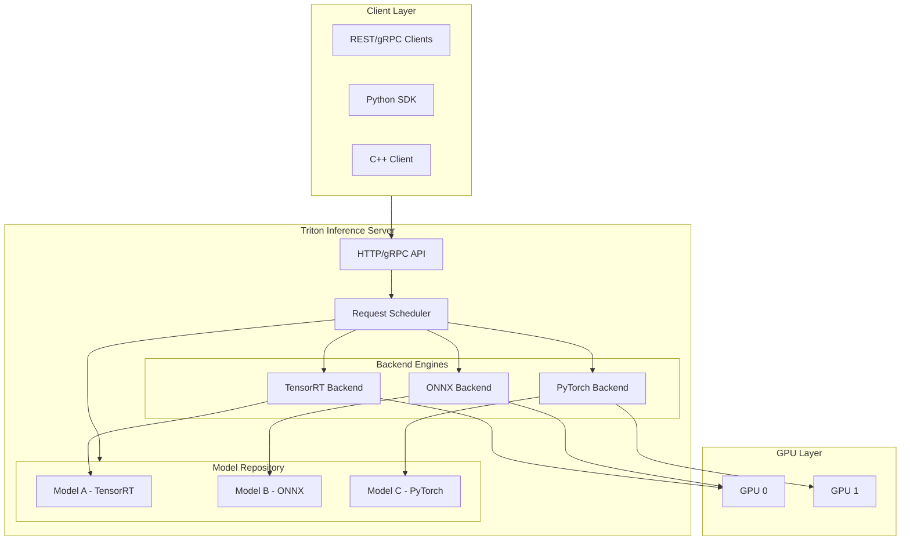
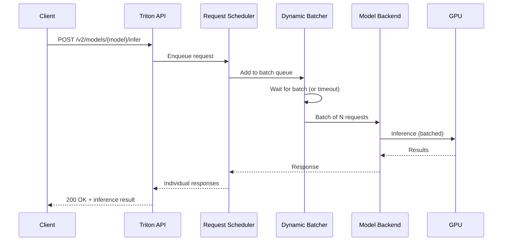
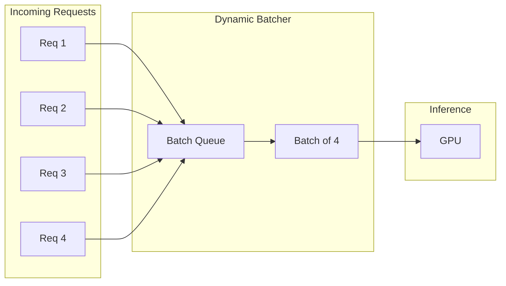
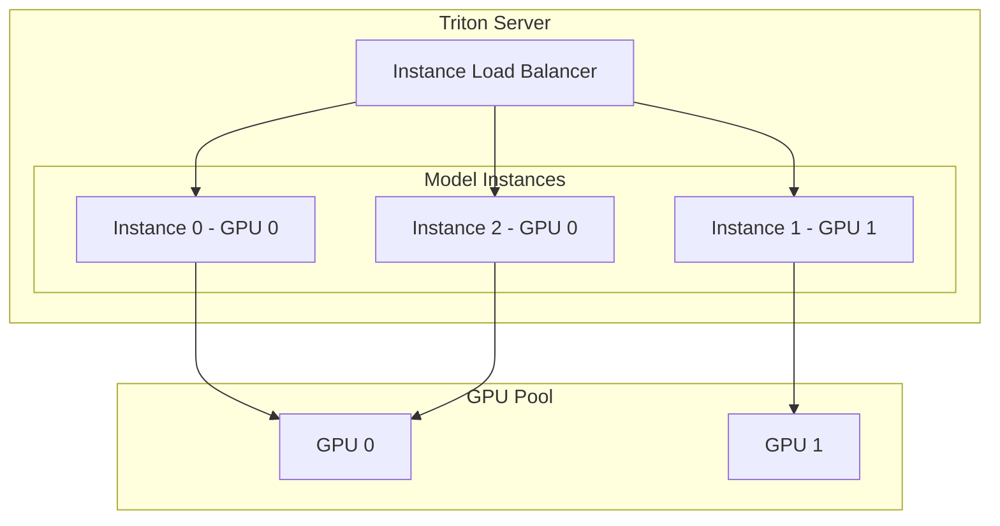
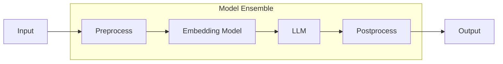
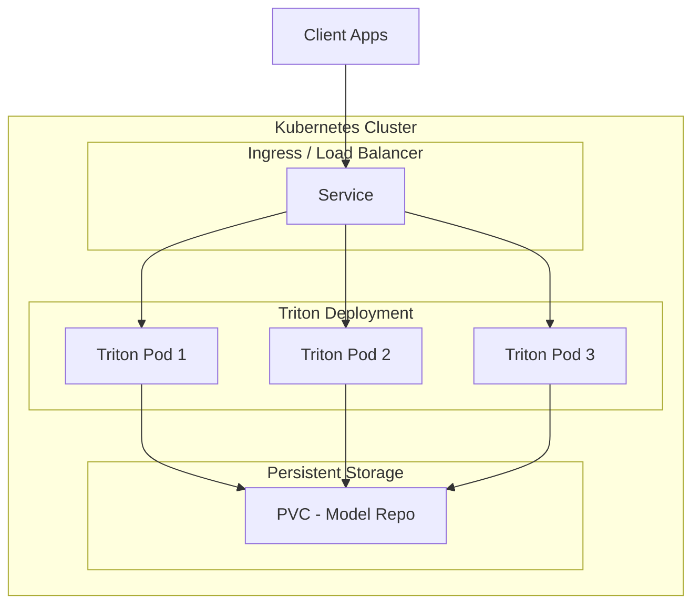

# Triton Inference Server – Architecture

## 1. Overview

**NVIDIA Triton Inference Server** is an open-source inference serving software that enables deployment of ML/DL models at scale. It supports multiple frameworks (TensorFlow, PyTorch, ONNX, TensorRT) and is designed for **low latency**, **high throughput**, and **flexible model deployment** in production.

---

## 2. High-Level Architecture Diagram



---

## 3. Core Components

| Component | Role |
|-----------|------|
| **HTTP/gRPC API** | Entry point for inference requests; supports REST and gRPC |
| **Request Scheduler** | Queues, batches, and schedules requests across models/GPUs |
| **Model Repository** | File-based store (local path or cloud) where models are loaded from |
| **Backend Engines** | Framework-specific runtimes (TensorRT, ONNX, PyTorch, etc.) |
| **Dynamic Batching** | Combines multiple requests into batches for higher throughput |

---

## 4. Request Flow (Step-by-Step)



---

## 5. Model Repository Layout

```
model_repository/
├── model_name/
│   ├── config.pbtxt          # Model configuration
│   ├── 1/                     # Version directory (version 1)
│   │   └── model.plan         # TensorRT engine / .onnx / .pt
│   └── 2/                     # Version directory (version 2)
│       └── model.plan
└── ensemble_model/            # Model ensembles
    ├── config.pbtxt
    └── 1/
        └── (no files - references other models)
```

---

## 6. Dynamic Batching Architecture



**Key settings in `config.pbtxt`:**

- `dynamic_batching { max_queue_delay_microseconds: N }` – Max wait before sending batch
- `max_batch_size` – Maximum requests per batch
- Trade-off: **latency vs throughput**

---

## 7. Multi-GPU / Multi-Instance Architecture



**Configuration** (`config.pbtxt`):

```
instance_group [
  {
    count: 2
    kind: KIND_GPU
    gpus: [0]
  },
  {
    count: 1
    kind: KIND_GPU
    gpus: [1]
  }
]
```

---

## 8. Model Ensemble Architecture

Enables multi-stage pipelines (e.g., preprocessing → embedding → LLM → post-processing).



**Use case:** Chained inference without client-side orchestration.

---

## 9. Triton + Kubernetes Deployment Architecture



---

## 10. Why This Architecture Matters

| Aspect | Benefit |
|--------|---------|
| **Dynamic batching** | Higher GPU utilization, better throughput |
| **Multi-instance** | Parallel execution, horizontal scale per model |
| **Model ensembles** | Complex pipelines without extra client logic |
| **Framework agnostic** | Mix TensorRT, ONNX, PyTorch in one server |
| **Versioning** | A/B testing, gradual rollouts via model versions |

---

## Next Steps

- [When/What/How to Use Triton](./02-when-what-how.md) – Decision guide
- [Configuration & Deployment](./03-configuration-deployment.md) – Step-by-step setup
- [Troubleshooting](./04-troubleshooting.md) – Common issues and fixes
