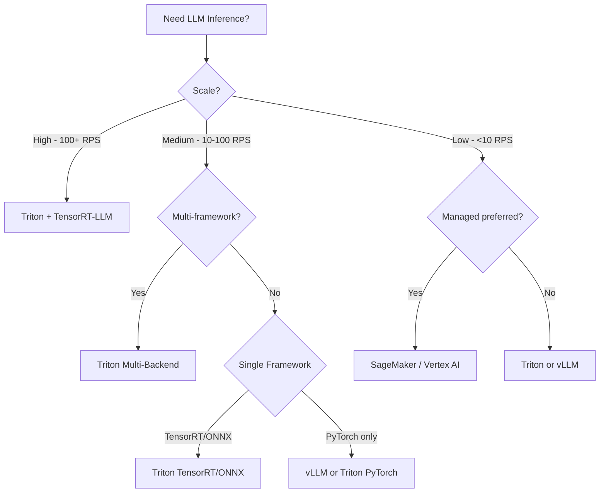
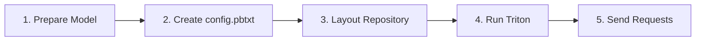
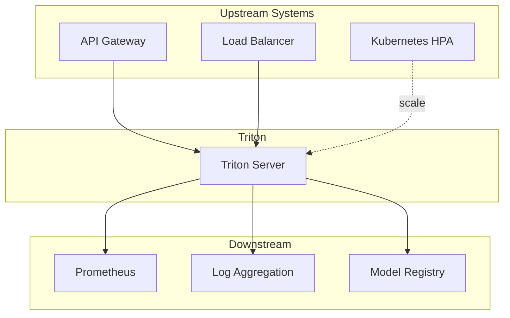

# Triton Inference Server – When, What, and How to Use

## 1. When to Use Triton

### Use Triton When

| Scenario | Reason |
|----------|--------|
| **LLM inference at scale** | Dynamic batching, multi-GPU, production-grade serving |
| **Multi-framework deployment** | Need TensorRT, ONNX, PyTorch in one serving layer |
| **Low latency + high throughput** | Optimized scheduler and backend engines |
| **Kubernetes/container deployment** | Native container support, stateless design |
| **Model ensembles** | Preprocess → model → postprocess pipelines |
| **A/B testing / gradual rollouts** | Model versioning built-in |
| **GPU utilization optimization** | Batching and instance tuning |

### Prefer Alternatives When

| Scenario | Alternative |
|----------|-------------|
| Simple single-model API | vLLM, Hugging Face Inference Endpoints |
| Serverless / pay-per-request | AWS SageMaker, GCP Vertex AI (managed) |
| Edge / embedded inference | TensorRT only, no full Triton stack |
| Very small teams, minimal ops | Managed cloud inference |

---

## 2. What to Use (Decision Tree)



---

## 3. Backend Selection Guide

| Backend | When to Use | Strengths | Limitations |
|---------|-------------|-----------|-------------|
| **TensorRT** | Production LLMs, lowest latency | Optimized kernels, FP16/INT8 | NVIDIA GPU only, build step required |
| **TensorRT-LLM** | LLM-specific, paged attention, batching | Best for LLMs, KV cache | NVIDIA only |
| **ONNX Runtime** | Cross-vendor, portable models | Portable, good optimization | May be slower than TensorRT |
| **PyTorch** | Rapid prototyping, custom logic | Flexible, familiar | Higher latency than TensorRT |
| **Python** | Custom logic, glue code | Full Python flexibility | Slower, not for hot path |

---

## 4. How to Use: Quick Start Workflow



### Step 1: Prepare Model

- **TensorRT**: Convert model → `.plan` or `.engine`
- **ONNX**: Export to `.onnx`
- **TensorRT-LLM**: Build with `trtllm-build` → Triton-compatible artifacts

### Step 2: Create `config.pbtxt`

```protobuf
name: "my_llm"
platform: "tensorrt_llm"
max_batch_size: 0  # 0 = dynamic batching for variable batch

input [
  {
    name: "input_ids"
    data_type: TYPE_INT32
    dims: [ -1 ]   # Dynamic shape
  }
]

output [
  {
    name: "output_ids"
    data_type: TYPE_INT32
    dims: [ -1 ]
  }
]

instance_group [
  {
    count: 1
    kind: KIND_GPU
    gpus: [ 0 ]
  }
]

dynamic_batching {
  max_queue_delay_microseconds: 500
}
```

### Step 3: Layout Repository

```
model_repository/
└── my_llm/
    ├── config.pbtxt
    └── 1/
        ├── model.py          # For TensorRT-LLM
        └── (engine files)
```

### Step 4: Run Triton

```bash
docker run --gpus all -p 8000:8000 -p 8001:8001 -p 8002:8002 \
  -v /path/to/model_repository:/models \
  nvcr.io/nvidia/tritonserver:24.01-py3 \
  tritonserver --model-repository=/models
```

### Step 5: Send Requests

```python
import tritonclient.http as httpclient

client = httpclient.InferenceServerClient(url="localhost:8000")
result = client.infer("my_llm", inputs=[...])
```

---

## 5. Configuration Decision Matrix

| Goal | Configuration Change |
|------|----------------------|
| Lower latency | Reduce `max_queue_delay_microseconds`, fewer `max_batch_size` |
| Higher throughput | Increase batch size, add instances |
| Multiple GPUs | Add `instance_group` entries with different `gpus` |
| Sequence batching (LLM) | Use `sequence_batching` in config |
| Model warm-up | Set `model_warmup` in config |
| Rate limiting | Use Triton `rate_limiter` or external API gateway |

---

## 6. Integration Points



---

## 7. Sizing Guidelines

| Metric | Small | Medium | Large |
|--------|-------|--------|-------|
| **RPS** | &lt; 50 | 50–500 | 500+ |
| **GPUs per Triton** | 1 | 2–4 | 4+ |
| **Instances per model** | 1 | 2–4 | 4–8 |
| **Batch size** | 8–16 | 16–64 | 64–256 |
| **Queue delay (μs)** | 100–200 | 200–500 | 500–1000 |

---

## Next Steps

- [Configuration & Deployment](./03-configuration-deployment.md)
- [Troubleshooting](./04-troubleshooting.md)
