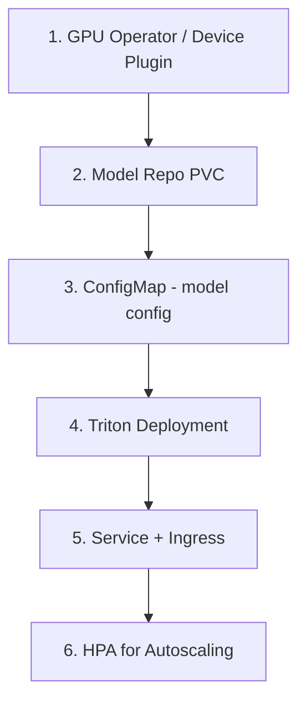
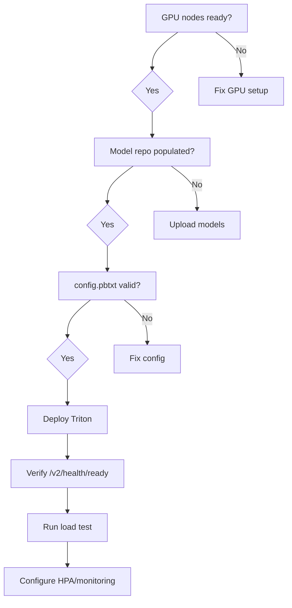

# Triton Inference Server – Configuration & Deployment

## 1. Step-by-Step Deployment on Kubernetes

### 1.1 Prerequisites

- Kubernetes cluster (1.24+) with NVIDIA GPU nodes
- `nvidia-device-plugin` DaemonSet installed
- `kubectl` configured
- Container registry access for Triton image

### 1.2 Deployment Workflow



---

### Step 1: Install NVIDIA GPU Operator (if not present)

```bash
# Add Helm repo
helm repo add nvidia https://nvidia.github.io/gpu-operator
helm repo update

# Install GPU Operator
helm install gpu-operator nvidia/gpu-operator \
  -n gpu-operator --create-namespace \
  --set driver.enabled=false  # Use pre-installed drivers if needed
```

### Step 2: Create Model Repository PVC

```yaml
# pvc-model-repo.yaml
apiVersion: v1
kind: PersistentVolumeClaim
metadata:
  name: triton-model-repo
  namespace: inference
spec:
  accessModes:
    - ReadOnlyMany   # Multiple pods can read
  resources:
    requests:
      storage: 100Gi
  storageClassName: fast-ssd
```

**Populate models:**

```bash
# Copy models to PVC or use init container
kubectl run model-loader --rm -it --restart=Never \
  --image=busybox \
  -n inference \
  --overrides='{"spec":{"containers":[{"name":"loader","image":"busybox","command":["sleep","3600"],"volumeMounts":[{"name":"models","mountPath":"/models"}]}],"volumes":[{"name":"models","persistentVolumeClaim":{"claimName":"triton-model-repo"}}]}}'
```

### Step 3: Triton Deployment

```yaml
# triton-deployment.yaml
apiVersion: apps/v1
kind: Deployment
metadata:
  name: triton-inference
  namespace: inference
spec:
  replicas: 2
  selector:
    matchLabels:
      app: triton
  template:
    metadata:
      labels:
        app: triton
    spec:
      containers:
        - name: triton
          image: nvcr.io/nvidia/tritonserver:24.01-py3
          args:
            - tritonserver
            - --model-repository=/models
            - --strict-model-config=false
            - --http-port=8000
            - --grpc-port=8001
            - --metrics-port=8002
          ports:
            - containerPort: 8000
              name: http
            - containerPort: 8001
              name: grpc
            - containerPort: 8002
              name: metrics
          resources:
            limits:
              nvidia.com/gpu: 1
            requests:
              nvidia.com/gpu: 1
              memory: "16Gi"
          volumeMounts:
            - name: models
              mountPath: /models
              readOnly: true
          livenessProbe:
            httpGet:
              path: /v2/health/live
              port: 8000
            initialDelaySeconds: 60
            periodSeconds: 10
          readinessProbe:
            httpGet:
              path: /v2/health/ready
              port: 8000
            initialDelaySeconds: 120
            periodSeconds: 10
      volumes:
        - name: models
          persistentVolumeClaim:
            claimName: triton-model-repo
```

### Step 4: Service & Ingress

```yaml
# triton-service.yaml
apiVersion: v1
kind: Service
metadata:
  name: triton-inference
  namespace: inference
spec:
  selector:
    app: triton
  ports:
    - name: http
      port: 8000
      targetPort: 8000
    - name: grpc
      port: 8001
      targetPort: 8001
    - name: metrics
      port: 8002
      targetPort: 8002
---
apiVersion: networking.k8s.io/v1
kind: Ingress
metadata:
  name: triton-ingress
  namespace: inference
  annotations:
    nginx.ingress.kubernetes.io/proxy-body-size: "100m"
spec:
  rules:
    - host: triton.inference.example.com
      http:
        paths:
          - path: /
            pathType: Prefix
            backend:
              service:
                name: triton-inference
                port:
                  number: 8000
```

### Step 5: HPA for Autoscaling

```yaml
# triton-hpa.yaml
apiVersion: autoscaling/v2
kind: HorizontalPodAutoscaler
metadata:
  name: triton-hpa
  namespace: inference
spec:
  scaleTargetRef:
    apiVersion: apps/v1
    kind: Deployment
    name: triton-inference
  minReplicas: 2
  maxReplicas: 10
  metrics:
    - type: Resource
      resource:
        name: cpu
        target:
          type: Utilization
          averageUtilization: 70
    - type: Pods
      pods:
        metric:
          name: nvidia_gpu_utilization
        target:
          type: AverageValue
          averageValue: "70"
```

---

## 2. Key Configuration Options (`config.pbtxt`)

### 2.1 Dynamic Batching

```protobuf
dynamic_batching {
  preferred_batch_size: [ 4, 8, 16 ]
  max_queue_delay_microseconds: 500
  preserve_ordering: false
}
```

| Parameter | Effect |
|-----------|--------|
| `preferred_batch_size` | Batch sizes Triton tries to form |
| `max_queue_delay_microseconds` | Max wait for more requests (lower = lower latency, lower throughput) |
| `preserve_ordering` | Keep request order when `true` |

### 2.2 Instance Groups

```protobuf
instance_group [
  {
    count: 2
    kind: KIND_GPU
    gpus: [ 0 ]
  },
  {
    count: 1
    kind: KIND_GPU
    gpus: [ 1 ]
  }
]
```

### 2.3 Sequence Batching (for LLM streaming)

```protobuf
sequence_batching {
  max_sequence_idle_microseconds: 5000000
  state [
    {
      input_name: "INPUT"
      output_name: "OUTPUT"
      data_type: TYPE_INT32
      dims: [ 1 ]
    }
  ]
}
```

---

## 3. Environment Variables

| Variable | Purpose |
|----------|---------|
| `CUDA_VISIBLE_DEVICES` | Restrict GPUs visible to Triton |
| `Triton-inference-server` | Server args via `TRITON_OPTS` |
| `NCCL_*` | Multi-GPU communication tuning |

---

## 4. Deployment Checklist



---

## Next Steps

- [Troubleshooting](./04-troubleshooting.md)
- [TensorRT-LLM Integration](../02-tensorrt-llm/01-overview-integration.md)
