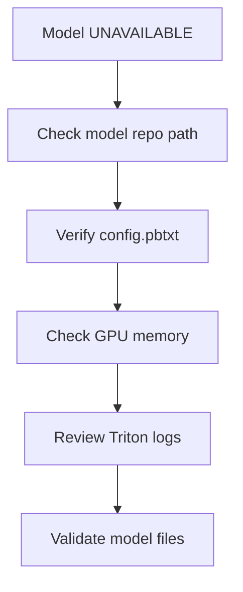
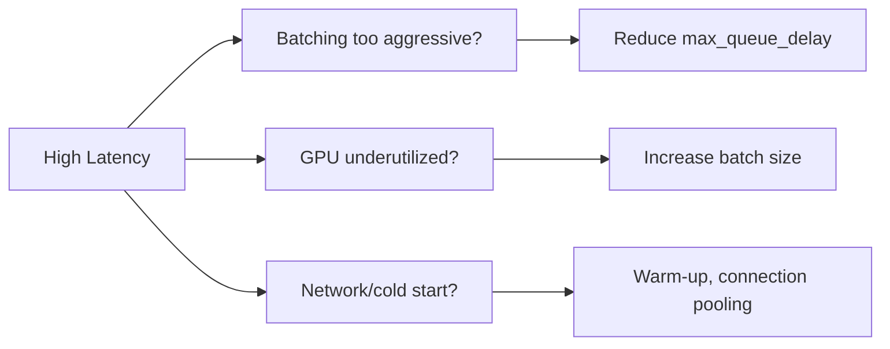

# Triton Inference Server – Troubleshooting

## 1. Common Issues & Solutions

### 1.1 Model Fails to Load

**Symptom:** Model in `LOADING` or `UNAVAILABLE` state.



**Checks:**

| Check | Command / Action |
|-------|------------------|
| Model path | `ls -la /models/<model_name>/` |
| Config syntax | `protoc` or manual validation |
| GPU memory | `nvidia-smi` – ensure sufficient VRAM |
| Triton logs | `kubectl logs <pod> -c triton` |

**Common causes:**

- Missing `config.pbtxt` or wrong `platform`
- Wrong version directory (must be numeric: `1/`, `2/`)
- OOM: model too large for GPU → reduce batch size or use model parallelism

---

### 1.2 High Latency

**Symptom:** P99 latency exceeds SLA.



**Tuning:**

| Factor | Adjustment |
|--------|-------------|
| Batching | Lower `max_queue_delay_microseconds` |
| Batch size | Lower `max_batch_size` for latency-sensitive workloads |
| Instances | Add more instances for parallelism |
| Connection | Use gRPC + keep-alive, connection pooling |

---

### 1.3 Low Throughput

**Symptom:** GPU utilization low despite load.

| Cause | Fix |
|-------|-----|
| Small batch size | Increase `max_batch_size`, `preferred_batch_size` |
| Short queue delay | Increase `max_queue_delay_microseconds` |
| Single instance | Add `instance_group` entries |
| Client bottleneck | Parallel clients, async requests |

---

### 1.4 Out-of-Memory (OOM)

**Symptom:** Triton crash, CUDA OOM.

| Mitigation | Action |
|------------|--------|
| Reduce batch size | Lower `max_batch_size` |
| Fewer instances | Reduce `count` in `instance_group` |
| FP16/INT8 | Use lower precision |
| Tensor parallelism | Split model across GPUs (TensorRT-LLM) |

---

### 1.5 Connection / Timeout Issues

**Symptom:** Client timeouts, connection reset.

| Check | Action |
|-------|--------|
| Readiness | Ensure `/v2/health/ready` returns 200 before routing traffic |
| Timeouts | Increase client timeout; large batches can take seconds |
| Keep-alive | Enable HTTP keep-alive, gRPC keepalive |
| Load balancer | Check LB timeout (e.g. nginx `proxy_read_timeout`) |

---

## 2. Diagnostic Commands

```bash
# Health check
curl http://localhost:8000/v2/health/ready

# Model status
curl http://localhost:8000/v2/models/<model_name>/ready

# Server metadata
curl http://localhost:8000/v2

# Metrics (Prometheus)
curl http://localhost:8002/metrics
```

---

## 3. Metrics to Monitor

| Metric | Meaning |
|--------|---------|
| `nv_inference_request_success` | Successful inferences |
| `nv_inference_request_failure` | Failed inferences |
| `nv_inference_queue_duration_us` | Time in queue |
| `nv_inference_compute_infer_duration_us` | Compute time |
| `nv_gpu_utilization` | GPU utilization |
| `nv_gpu_memory_total_bytes` | GPU memory used |

---

## 4. Log Levels

```bash
# Verbose logging
tritonserver --model-repository=/models --log-verbose=1

# Log to file
tritonserver --model-repository=/models --log-file=/var/log/triton.log
```

---

## Next Steps

- [TensorRT-LLM Integration](../02-tensorrt-llm/01-overview-integration.md)
- [Scaling & Availability](../04-scaling-availability/01-load-balancing.md)
