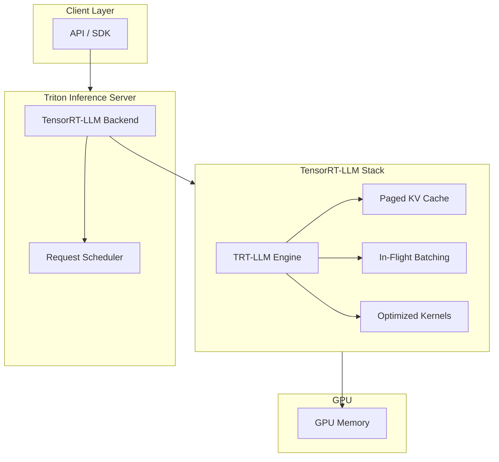
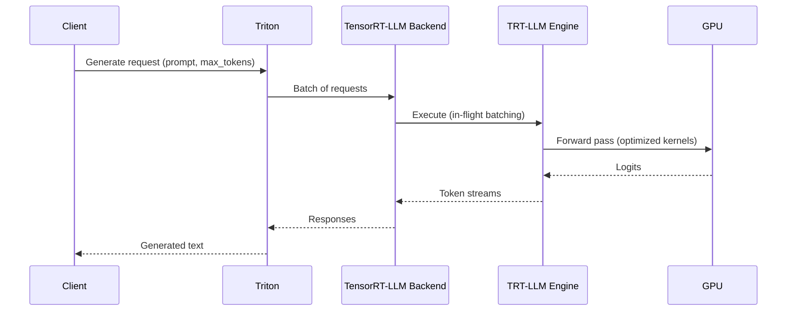

# TensorRT-LLM – Overview & Triton Integration

## 1. What is TensorRT-LLM?

**TensorRT-LLM** is an open-source library for optimizing and deploying Large Language Models (LLMs) on NVIDIA GPUs. It provides:

- **Optimized kernels** for transformer architectures
- **In-flight batching** (continuous batching)
- **Paged attention** (KV cache optimization)
- **Multi-GPU support** (tensor and pipeline parallelism)
- **Quantization** (FP8, INT8, INT4)

---

## 2. Architecture: TensorRT-LLM + Triton



---

## 3. End-to-End Workflow


### Step 1: Obtain Model

- Hugging Face (e.g. `meta-llama/Llama-2-7b-hf`)
- NVIDIA NGC
- Custom checkpoint

### Step 2: Convert to TensorRT-LLM Format

```bash
# Example: Convert LLaMA
python convert_checkpoint.py \
  --model_dir ./Llama-2-7b-hf \
  --output_dir ./llama2_7b_engine \
  --tp_size 1 \
  --dtype float16
```

### Step 3: Build Engine

```bash
trtllm-build \
  --checkpoint_dir ./llama2_7b_engine \
  --output_dir ./engine_output \
  --gemm_plugin float16 \
  --max_batch_size 64 \
  --max_input_len 2048 \
  --max_output_len 1024
```

### Step 4: Deploy with Triton

```
model_repository/
└── llama2_7b/
    ├── config.pbtxt
    └── 1/
        ├── rank0.engine      # or multiple ranks for TP
        └── model.py         # TensorRT-LLM Python backend
```

### Step 5: Inference

```python
import tritonclient.http as httpclient

client = httpclient.InferenceServerClient(url="localhost:8000")
# Use generate endpoint for LLM completion
```

---

## 4. Why TensorRT-LLM + Triton?

| Benefit | Explanation |
|---------|-------------|
| **Production-grade** | Triton adds batching, multi-model, versioning, metrics |
| **Unified API** | Same HTTP/gRPC API for all Triton backends |
| **Ecosystem** | Prometheus, K8s, load balancers work with Triton |
| **Flexibility** | Can add preprocessing, postprocessing via ensembles |
| **TRT-LLM optimizations** | Paged attention, in-flight batching, quantization |

---

## 5. Integration Architecture (Detailed)



---

## 6. Directory Structure for Triton + TensorRT-LLM

```
model_repository/
└── llama2_7b/
    ├── config.pbtxt
    └── 1/
        ├── model.py           # Backend entrypoint
        ├── __init__.py
        ├── rank0.engine       # Tensor parallel rank 0
        ├── rank1.engine       # Tensor parallel rank 1 (if tp=2)
        └── tokenizer.json
```

---

## 7. config.pbtxt for TensorRT-LLM

```protobuf
name: "llama2_7b"
platform: "tensorrt_llm"
max_batch_size: 0

input [
  {
    name: "input_ids"
    data_type: TYPE_INT32
    dims: [ -1 ]
  },
  {
    name: "input_lengths"
    data_type: TYPE_INT32
    dims: [ -1 ]
  }
]

output [
  {
    name: "output_ids"
    data_type: TYPE_INT32
    dims: [ -1 ]
  }
]

instance_group [
  {
    count: 2
    kind: KIND_GPU
    gpus: [ 0, 1 ]
  }
]

parameters: {
  key: "tensor_parallel_size"
  value: { string_value: "2" }
}
```

---

## Next Steps

- [Optimization Techniques](./02-optimization-techniques.md)
- [Triton + TRT-LLM Workflow](./03-triton-trtllm-workflow.md)
