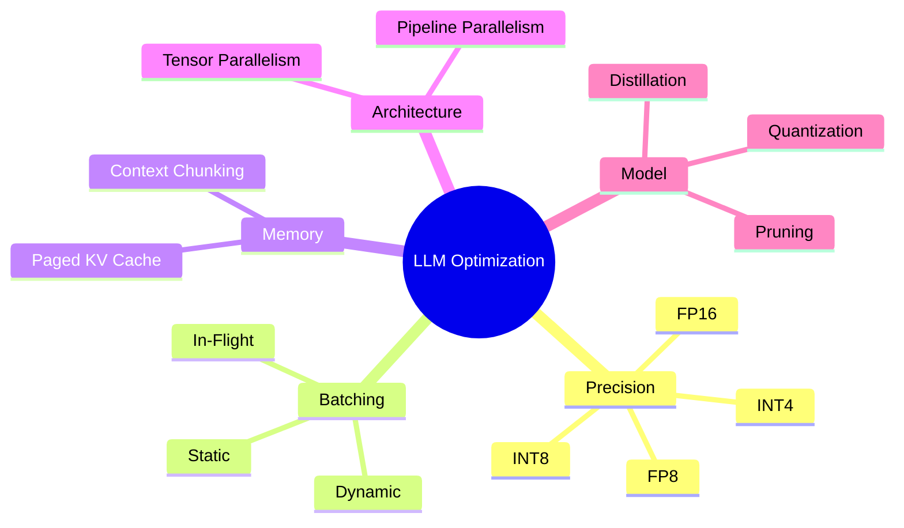
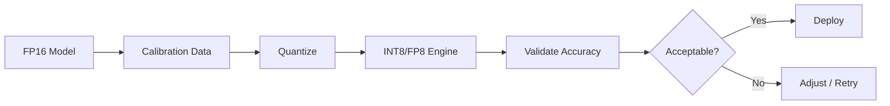
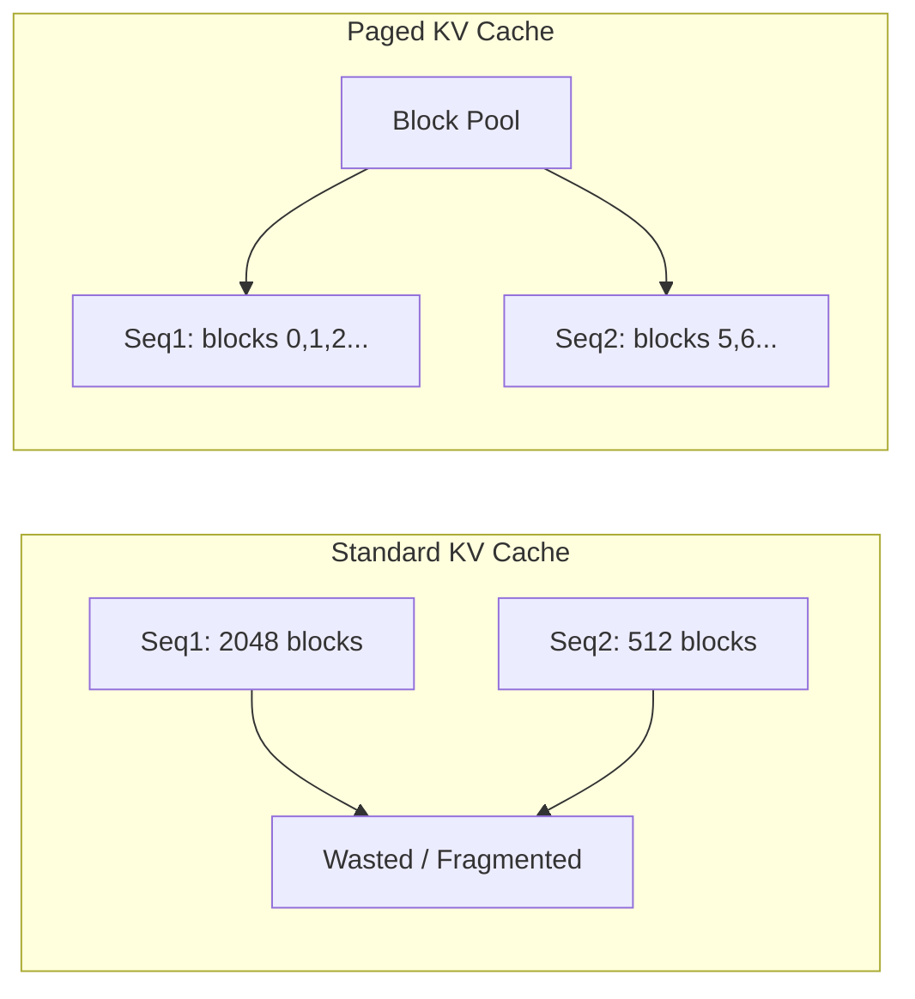
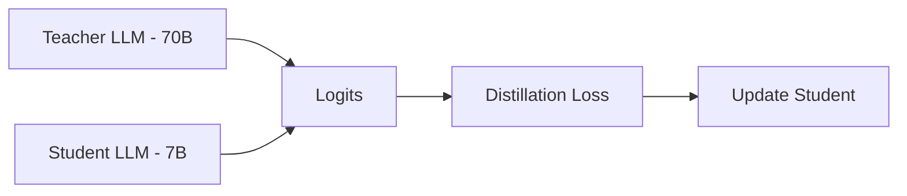
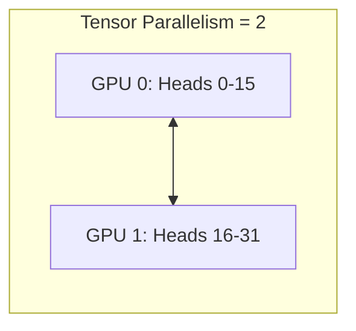
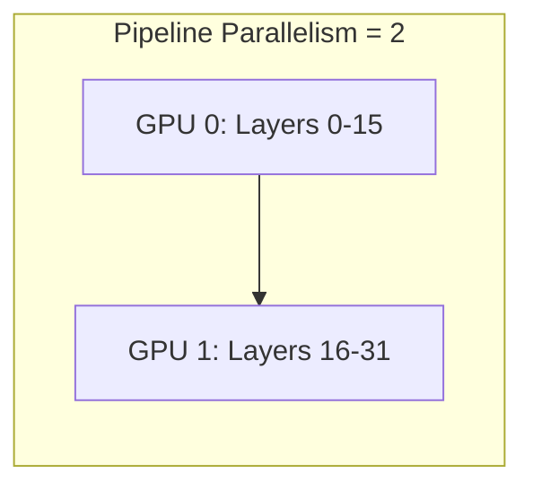

# TensorRT-LLM – Optimization Techniques

## 1. Overview: Why Optimize?

LLM inference is memory- and compute-intensive. Optimization aims to:

- **Reduce latency** (time to first token, time per token)
- **Increase throughput** (tokens/second, requests/second)
- **Lower cost** (smaller GPUs, fewer nodes)
- **Improve availability** (fit more models per GPU)

---

## 2. Optimization Techniques Summary



---

## 3. Precision / Quantization

### 3.1 Options

| Precision | Memory | Speed | Quality | When to Use |
|-----------|--------|-------|---------|-------------|
| FP32 | 4 bytes/param | Slowest | Best | Debugging, calibration |
| FP16 | 2 bytes/param | Fast | Very good | Default production |
| INT8 | 1 byte/param | Faster | Good (calibrated) | Memory-bound |
| FP8 | 1 byte/param | Very fast | Good | Ampere+ (A100, H100) |
| INT4 | 0.5 bytes/param | Fastest | Acceptable | Very large models |

### 3.2 Quantization Workflow



### 3.3 TensorRT-LLM Quantization

```bash
# FP8 (recommended for A100/H100)
trtllm-build \
  --checkpoint_dir ./ckpt \
  --output_dir ./engine \
  --use_fp8 \
  --fp8_kv_cache

# INT8 (with calibration)
trtllm-build \
  --checkpoint_dir ./ckpt \
  --output_dir ./engine \
  --use_int8 \
  --calibration_cache_path ./calib.cache
```

---

## 4. Batching Strategies

### 4.1 Static vs Dynamic vs In-Flight


### 4.2 In-Flight Batching Benefits

- **No padding waste**: Variable-length sequences
- **Early exit**: Finished sequences leave batch immediately
- **Higher utilization**: GPU rarely idle waiting for full batch

---

## 5. Paged KV Cache

### 5.1 Problem

Standard KV cache: one contiguous block per sequence. Leads to:

- Fragmentation
- Wasted memory for short sequences
- OOM for long contexts

### 5.2 Solution: Paged Attention



**TensorRT-LLM**: Paged KV cache enabled by default. Configure via `max_num_tokens` in engine build.

---

## 6. Pruning

### 6.1 What is Pruning?

Remove less important weights (e.g. small magnitudes) to reduce model size and compute.

| Type | Description |
|------|-------------|
| Unstructured | Individual weights to zero |
| Structured | Remove entire neurons/heads |
| Movement pruning | Learn importance during training |

### 6.2 When to Use

- Model too large for target GPU
- Latency-sensitive, can tolerate some quality loss
- Fine-tuned models with redundant capacity

---

## 7. Knowledge Distillation

### 7.1 Concept

Train a **student** model to mimic a **teacher** (larger) model output.



### 7.2 Benefits

- Smaller, faster student for deployment
- Preserve much of teacher quality
- Useful for domain-specific compression

---

## 8. Tensor & Pipeline Parallelism

### 8.1 Tensor Parallelism (TP)

Split layers across GPUs (e.g. split attention heads).



**TensorRT-LLM**: `--tp_size 2` (or 4, 8) in build.

### 8.2 Pipeline Parallelism (PP)

Split layers by depth across GPUs.



**TensorRT-LLM**: `--pp_size 2` for pipeline parallelism.

---

## 9. Decision Matrix: Which Optimization When?

| Goal | Technique |
|------|------------|
| Lower latency | FP16/FP8, in-flight batching, fewer batch size |
| Higher throughput | FP8/INT8, larger batch, more instances |
| Fit larger model | Quantization (INT8/INT4), pruning, TP/PP |
| Long context | Paged KV cache, context chunking |
| Cost reduction | Quantization, distillation, smaller student |

---

## Next Steps

- [Triton + TRT-LLM Workflow](./03-triton-trtllm-workflow.md)
- [MLOps Pipelines](../03-mlops-pipelines/01-kubeflow-pipelines.md)
