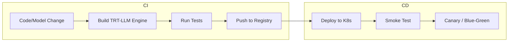

# Triton + TensorRT-LLM – End-to-End Workflow

## 1. Complete Pipeline Architecture

```mermaid
flowchart TB
    subgraph Source["Source"]
        HF[Hugging Face / NGC]
        Custom[Custom Checkpoint]
    end

    subgraph Build["Build Pipeline"]
        Convert[convert_checkpoint.py]
        Build[trtllm-build]
        Validate[Validate Engine]
        Convert --> Build --> Validate
    end

    subgraph Deploy["Deploy"]
        Repo[Model Repository]
        Triton[Triton Server]
        K8s[Kubernetes]
        Repo --> Triton --> K8s
    end

    subgraph Inference["Inference"]
        Client[Clients]
        LB[Load Balancer]
        Client --> LB --> Triton
    end

    HF --> Convert
    Custom --> Convert
    Build --> Repo
```

---

## 2. Step-by-Step Workflow

### Phase 1: Model Preparation


### Phase 2: Build Configuration

| Parameter | Purpose | Example |
|-----------|---------|---------|
| `--tp_size` | Tensor parallel GPUs | 1, 2, 4, 8 |
| `--pp_size` | Pipeline parallel stages | 1, 2, 4 |
| `--max_batch_size` | Max batch | 64 |
| `--max_input_len` | Max prompt length | 4096 |
| `--max_output_len` | Max generation length | 2048 |
| `--use_fp8` | FP8 precision | - |
| `--gemm_plugin` | GEMM kernel plugin | float16, float8 |

### Phase 3: Triton Integration

1. Copy engine and `model.py` into model repository
2. Create `config.pbtxt` with `platform: "tensorrt_llm"`
3. Set `tensor_parallel_size` to match build

### Phase 4: Deployment

1. Push model repo to PVC or object storage
2. Deploy Triton on Kubernetes
3. Configure Service, Ingress, HPA
4. Set up monitoring (Prometheus, etc.)

---

## 3. CI/CD Integration



---

## 4. Model Versioning Strategy

```
model_repository/
└── llama2_7b/
    ├── config.pbtxt
    ├── 1/              # v1 - FP16
    │   └── rank0.engine
    ├── 2/              # v2 - FP8 (optimized)
    │   └── rank0.engine
    └── 3/              # v3 - INT8 (calibrated)
        └── rank0.engine
```

- Load specific version: `POST /v2/models/llama2_7b/versions/2/infer`
- A/B test: Route traffic by version

---

## 5. Troubleshooting: Build Failures

| Error | Cause | Fix |
|-------|-------|-----|
| OOM during build | Model too large | Reduce `max_batch_size`, use TP |
| Unsupported op | Custom op not in TRT-LLM | Use plugin or fallback to PyTorch |
| Accuracy drop | Quantization | Re-calibrate, use FP16 |
| Slow build | Large model | Use more CPU, SSD for temp files |

---

## Next Steps

- [MLOps Pipelines – Kubeflow](../03-mlops-pipelines/01-kubeflow-pipelines.md)
- [Scaling & Availability](../04-scaling-availability/01-load-balancing.md)
