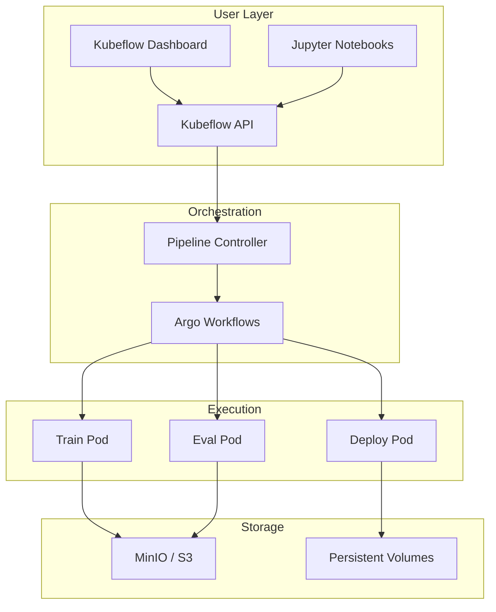
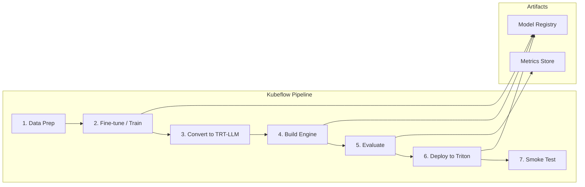
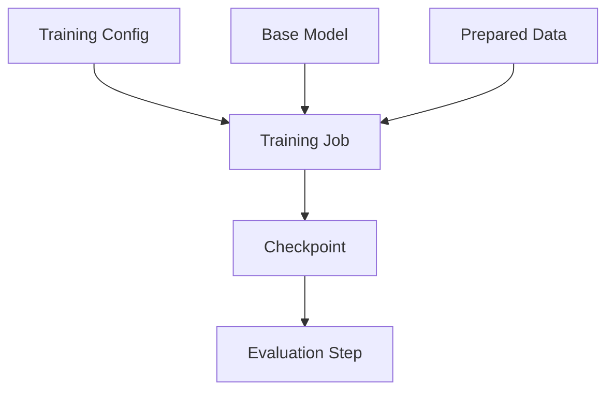
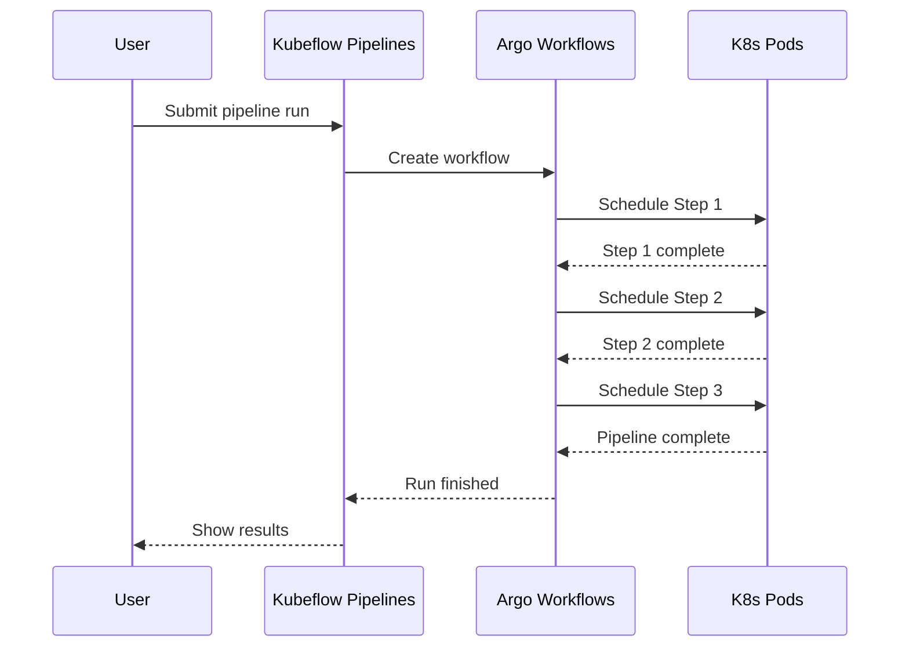

# MLOps Pipelines – Kubeflow

## 1. Overview

**Kubeflow** is an open-source ML platform on Kubernetes. It provides:

- **Kubeflow Pipelines (KFP)** – Orchestrate training, evaluation, deployment
- **Experiments & Runs** – Track experiments and compare runs
- **Artifact storage** – Models, metrics, datasets
- **Notebooks** – Jupyter for development
- **KFServing / KServe** – Model serving (optional, can use Triton instead)

---

## 2. Kubeflow Architecture



---

## 3. LLMOps Pipeline Architecture



---

## 4. Pipeline Component Details

### 4.1 Data Preparation

| Step | Purpose | Output |
|------|---------|--------|
| Ingest | Load from S3/GCS/DB | Raw dataset |
| Clean | Dedup, filter | Clean dataset |
| Tokenize | Prepare for training | Tokenized dataset |
| Split | Train/val/test | Split artifacts |

### 4.2 Training / Fine-Tuning



- Use **PyTorch** or **NeMo** for fine-tuning
- Run as Kubernetes Job with GPU
- Save checkpoint to object storage

### 4.3 Convert & Build

- **convert_checkpoint.py** – TRT-LLM format
- **trtllm-build** – Build TensorRT engine
- Output: Engine files for Triton

### 4.4 Deploy

- Copy engine to model repository (PVC or object storage)
- Update Triton model repo
- Optional: Load new model version via Triton API

### 4.5 Smoke Test

- Send sample requests
- Validate latency and output quality
- Fail pipeline if SLA not met

---

## 5. Sample Kubeflow Pipeline (Python DSL)

```python
from kfp import dsl
from kfp.dsl import pipeline, component

@component
def prepare_data(output_path: str) -> str:
    # Download, clean, tokenize
    return output_path

@component
def train_model(data_path: str, output_model: dsl.OutputPath(str)):
    # Fine-tune with PyTorch/NeMo
    pass

@component
def convert_and_build(model_path: str, engine_path: dsl.OutputPath(str)):
    # convert_checkpoint.py + trtllm-build
    pass

@component
def deploy_to_triton(engine_path: str):
    # Copy to model repo, trigger Triton reload
    pass

@pipeline(name="llm-training-pipeline")
def llm_pipeline():
    data = prepare_data(output_path="s3://bucket/data")
    model = train_model(data_path=data.output)
    engine = convert_and_build(model_path=model.output)
    deploy_to_triton(engine_path=engine.output)
```

---

## 6. Pipeline Execution Flow



---

## 7. Integration with Triton

| Integration Point | How |
|-------------------|-----|
| Model output | Copy engine to Triton model repo PVC |
| Model versioning | Use pipeline run ID as version |
| Rollback | Load previous version via Triton API |
| A/B test | Deploy multiple versions, route by header |

---

## 8. When to Use Kubeflow Pipelines

| Use Case | Fit |
|----------|-----|
| End-to-end training → deploy | ✓ |
| Experiment tracking | ✓ |
| Reproducible runs | ✓ |
| Multi-step workflows | ✓ |
| Simple single-job deploy | Consider simpler CI/CD |
| Non-Kubernetes env | Not applicable |

---

## Next Steps

- [NVIDIA On-Prem MLOps](./02-nvidia-onprem.md)
- [End-to-End Workflow](./03-end-to-end-workflow.md)
