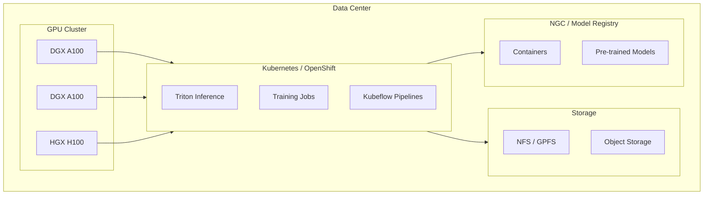
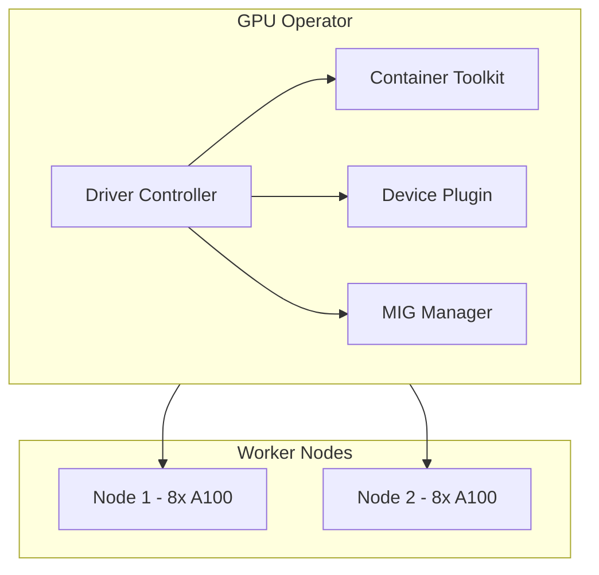
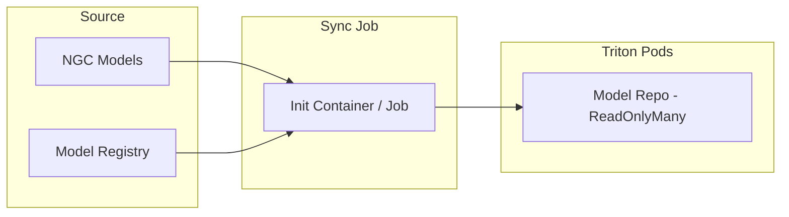

# MLOps / LLMOps on NVIDIA On-Premises

## 1. Overview

NVIDIA offers an **on-premises AI stack** for enterprises that want full control over data and infrastructure. Key components:

| Component | Purpose |
|-----------|---------|
| **NVIDIA AI Enterprise** | Licensed software stack (RAPIDS, Triton, etc.) |
| **NGC (NVIDIA NGC Catalog)** | Pre-built containers, models, Helm charts |
| **DGX / HGX** | GPU servers (A100, H100) |
| **Base Command Platform** | Orchestration, job scheduling (optional) |

---

## 2. On-Prem Architecture



---

## 3. NVIDIA GPU Operator

Manages GPU drivers, CUDA, container toolkit, and device plugin on Kubernetes.



**Installation:**

```bash
helm install gpu-operator nvidia/gpu-operator -n gpu-operator --create-namespace
```

---

## 4. Triton on NVIDIA On-Prem

### 4.1 Deployment Options

| Option | Use Case |
|--------|----------|
| **Bare metal + Docker** | Simple, single-node |
| **Kubernetes** | Multi-node, scaling |
| **OpenShift** | Enterprise, Red Hat stack |
| **VMware with vGPU** | Virtualized GPUs |

### 4.2 Model Repository Options

| Storage | Pros | Cons |
|---------|------|------|
| **NFS** | Simple, shared | Latency, single point |
| **GPFS / Lustre** | High throughput | Complex setup |
| **Object (S3/MinIO)** | Scalable | Triton needs sync to local |
| **PVC (K8s)** | Native K8s | Per-cluster |

### 4.3 Recommended Layout



---

## 5. MLOps Pipeline on NVIDIA On-Prem

```mermaid
flowchart TD
    subgraph Dev["Development"]
        Notebook[Jupyter on DGX]
        HF[Hugging Face / NGC]
    end

    subgraph Build["Build"]
        Convert[convert_checkpoint]
        Build[trtllm-build]
        Convert --> Build
    end

    subgraph Deploy["Deploy"]
        Repo[Model Repo - NFS]
        Triton[Triton on K8s]
        Repo --> Triton
    end

    subgraph Ops["Operations"]
        Prom[Prometheus]
        Grafana[Grafana]
        Alert[Alerting]
    end

    Dev --> Build
    Build --> Repo
    Triton --> Ops
```

---

## 6. DGX / HGX-Specific Considerations

| Aspect | Detail |
|--------|--------|
| **NVLink** | High GPU-to-GPU bandwidth for tensor parallel |
| **MIG** | Multi-Instance GPU – partition A100 for smaller workloads |
| **NVSwitch** | All-to-all GPU connectivity on DGX |
| **Storage** | Local NVMe for temp files during build |

### MIG Configuration Example

```yaml
# Partition A100 80GB into 2x 40GB instances
nvidia-smi -mig 1
nvidia-smi mig -cgi 1g.5gb -C
```

---

## 7. Networking for Multi-Node

| Requirement | Solution |
|-------------|----------|
| GPU-to-GPU (NCCL) | RDMA (RoCE/InfiniBand), fast interconnect |
| Client-to-Triton | Load balancer, Ingress |
| Model sync | NFS, object storage, or init containers |

---

## 8. Checklist: NVIDIA On-Prem LLMOps

- [ ] GPU Operator installed on all GPU nodes
- [ ] Triton image from NGC: `nvcr.io/nvidia/tritonserver`
- [ ] Model repository on shared storage (NFS/PVC)
- [ ] CUDA compatibility: driver vs container CUDA version
- [ ] Kubeflow (optional) for pipeline orchestration
- [ ] Prometheus + Grafana for Triton metrics
- [ ] Backup/restore for model repo and configs

---

## Next Steps

- [End-to-End Workflow](./03-end-to-end-workflow.md)
- [Scaling & Availability](../04-scaling-availability/01-load-balancing.md)
