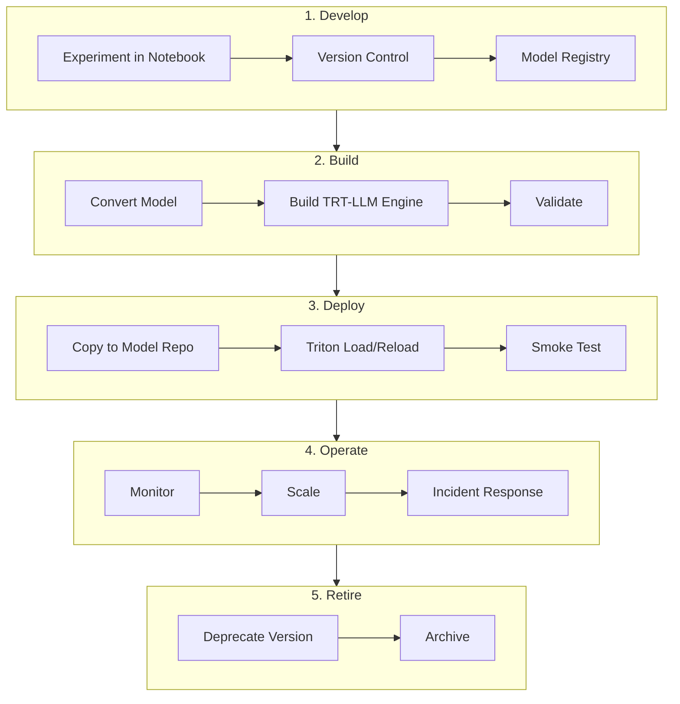
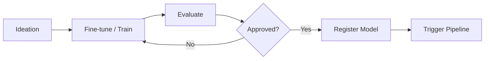
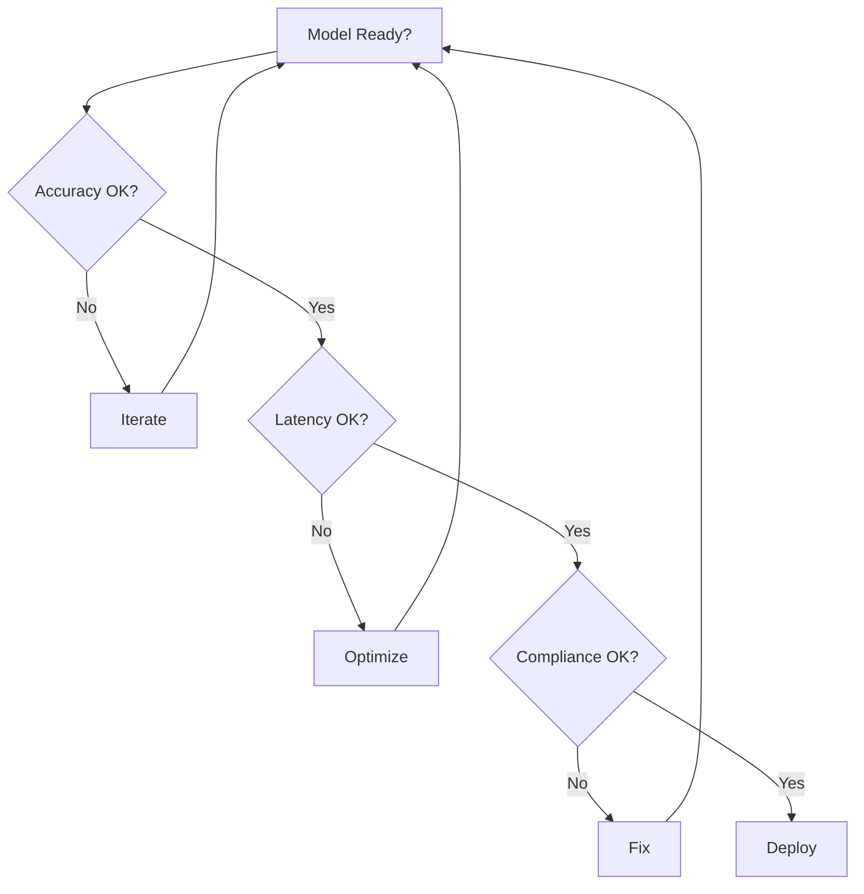

# MLOps / LLMOps – End-to-End Workflow

## 1. Complete Lifecycle

---

## 2. Detailed Workflow (Step-by-Step)

### Phase 1: Development

1. **Ideation** – Define use case, metrics, constraints
2. **Fine-tune / Train** – Use NeMo, Hugging Face, or custom
3. **Evaluate** – Accuracy, latency, fairness
4. **Register** – Push to MLflow, NGC, or custom registry
5. **Trigger** – Start MLOps pipeline (manual or CI)

### Phase 2: Build

1. **Convert** – `convert_checkpoint.py` for TRT-LLM
2. **Build** – `trtllm-build` with target config
3. **Validate** – Local inference test
4. **Package** – Engine + config + tokenizer

### Phase 3: Deploy

1. **Copy** – To model repo (PVC, NFS, S3 sync)
2. **Load** – Triton loads new version (or reload)
3. **Smoke** – Send test requests, check latency/output
4. **Route** – Update API gateway / load balancer if needed

### Phase 4: Operate

1. **Monitor** – Prometheus, Grafana, logs
2. **Scale** – HPA, cluster autoscaler
3. **Respond** – Incidents, changes, rollbacks

### Phase 5: Retire

1. **Deprecate** – Stop routing new traffic
2. **Archive** – Move to cold storage
3. **Delete** – Remove from Triton model repo

---

## 3. Decision Gates

---

## 4. Automation Triggers

| Trigger | Action |
|---------|--------|
| Git push to `models/` | Run build pipeline |
| Model registry new version | Deploy to staging |
| Manual approval | Deploy to production |
| Schedule | Retraining pipeline |
| Alert | Rollback or scale |

---

## 5. Role Responsibilities

| Role | Responsibilities |
|------|-------------------|
| **Data Scientist** | Train, evaluate, register |
| **ML Engineer** | Build pipeline, optimize, deploy |
| **Platform Engineer** | K8s, Triton, monitoring |
| **SRE** | Incidents, availability, scaling |

---

## 6. Metrics Across Lifecycle

| Phase | Metrics |
|-------|---------|
| Develop | Loss, accuracy, F1 |
| Build | Build time, engine size |
| Deploy | Deployment time, success rate |
| Operate | Latency, throughput, error rate, GPU util |
| Retire | Archive size, retention |

---

## Next Steps

- [Load Balancing](../04-scaling-availability/01-load-balancing.md)
- [High Availability](../04-scaling-availability/02-high-availability.md)
- [Monitoring & Observability](../04-scaling-availability/03-monitoring-observability.md)
