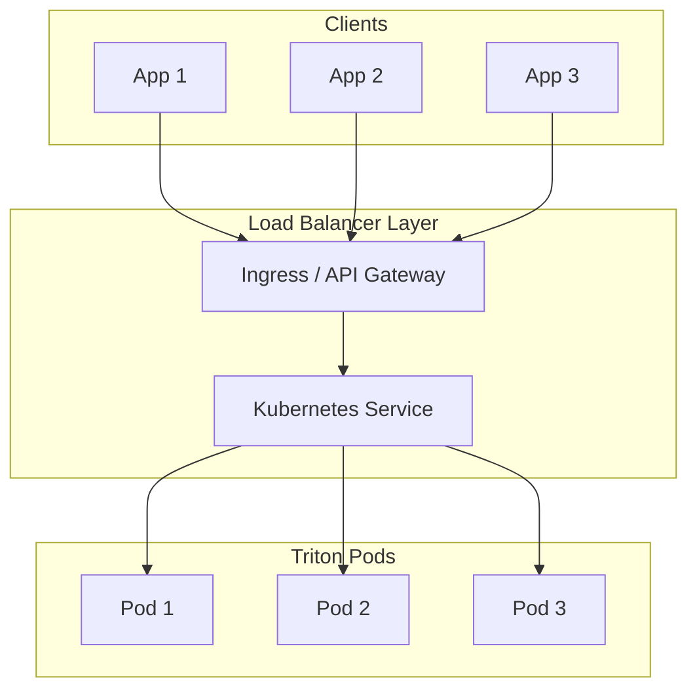
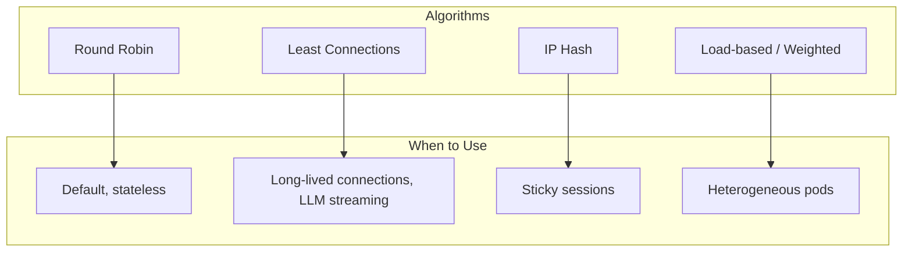
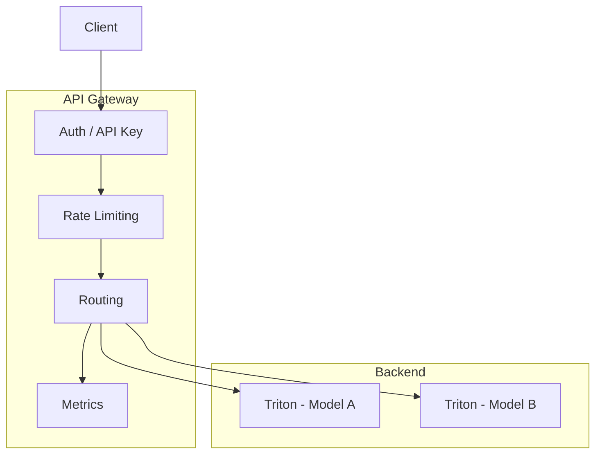
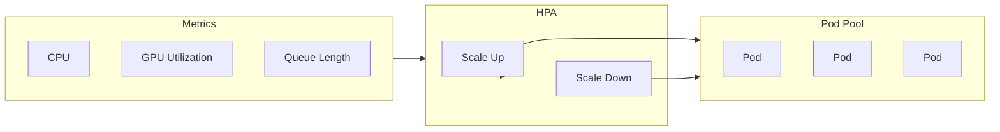
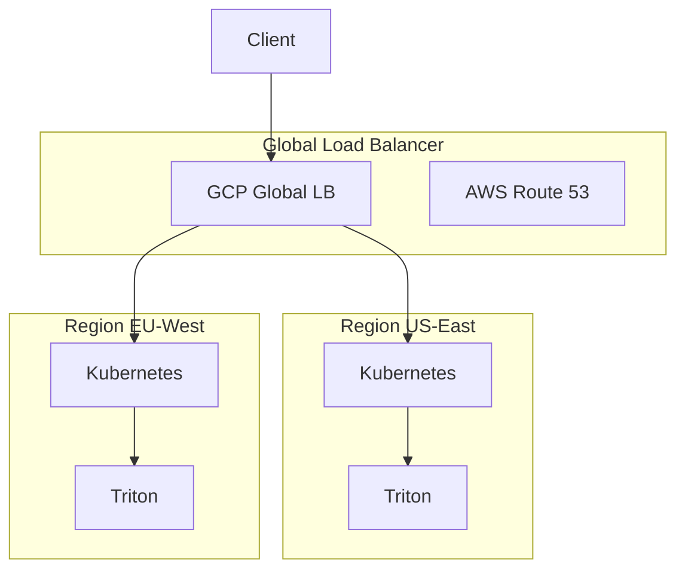

# Load Balancing for LLM Inference

## 1. Overview

Load balancing distributes inference requests across multiple Triton instances to:

- **Increase throughput** – More pods = more capacity
- **Reduce latency** – Avoid queue buildup on single pod
- **Improve availability** – Failover when a pod is unhealthy

---

## 2. Load Balancing Architecture



---

## 3. Kubernetes Service Types

| Type | Load Balancing | Use Case |
|------|----------------|----------|
| **ClusterIP** | Round-robin (internal) | Internal traffic |
| **NodePort** | Via kube-proxy | Development |
| **LoadBalancer** | Cloud LB (AWS ELB, GCP LB) | Production |
| **Ingress** | L7 routing, TLS | Production with paths/hosts |

---

## 4. Load Balancing Algorithms



| Algorithm | Pros | Cons |
|-----------|------|------|
| **Round Robin** | Simple, fair | Ignores pod load |
| **Least Connections** | Balances active requests | Needs connection tracking |
| **IP Hash** | Sticky sessions | May imbalance |
| **Weighted** | Handles different pod sizes | More configuration |

**For LLM streaming**: Prefer **least connections** – long requests shouldn’t overload one pod.

---

## 5. Nginx Ingress Example

```yaml
apiVersion: networking.k8s.io/v1
kind: Ingress
metadata:
  name: triton-ingress
  annotations:
    nginx.ingress.kubernetes.io/upstream-hash-by: "$request_uri"  # Optional: sticky
    nginx.ingress.kubernetes.io/proxy-body-size: "100m"
    nginx.ingress.kubernetes.io/proxy-read-timeout: "600"
    nginx.ingress.kubernetes.io/proxy-send-timeout: "600"
spec:
  ingressClassName: nginx
  rules:
    - host: inference.example.com
      http:
        paths:
          - path: /
            pathType: Prefix
            backend:
              service:
                name: triton-inference
                port:
                  number: 8000
```

---

## 6. API Gateway Patterns



**Path-based routing:**

- `/v1/models/llama` → Triton model `llama`
- `/v1/models/mistral` → Triton model `mistral`

---

## 7. Autoscaling Integration



Load balancer automatically includes new pods and removes scaled-down ones via Kubernetes Service endpoints.

---

## 8. Multi-Region Load Balancing



- Use **latency-based routing** or **geographic routing**
- Consider **model replication** across regions

---

## 9. Checklist

- [ ] Kubernetes Service with correct selector
- [ ] Readiness probes so unhealthy pods are excluded
- [ ] Timeouts tuned for long LLM requests
- [ ] Algorithm chosen (round-robin vs least connections)
- [ ] HPA so pool size adapts to load

---

## Next Steps

- [High Availability](./02-high-availability.md)
- [Monitoring & Observability](./03-monitoring-observability.md)
