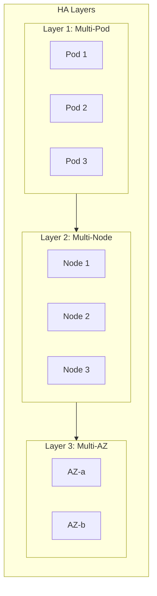
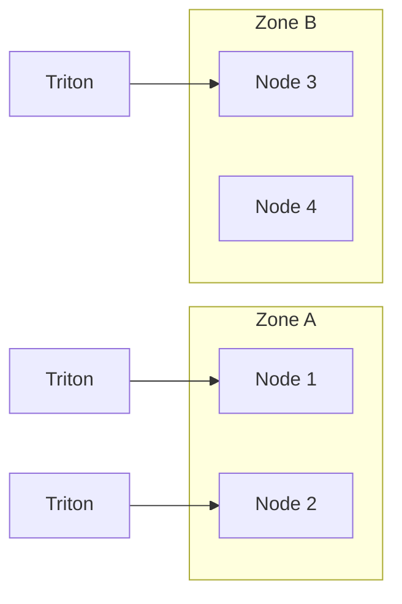
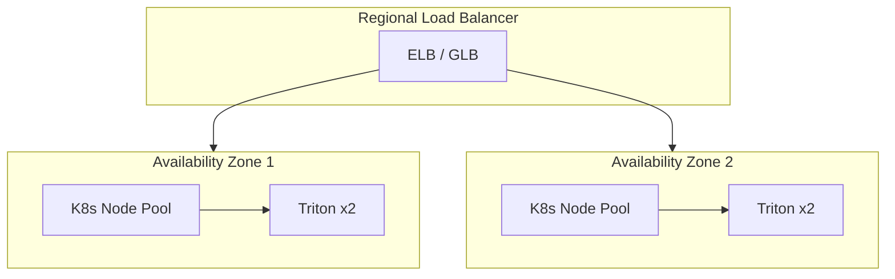
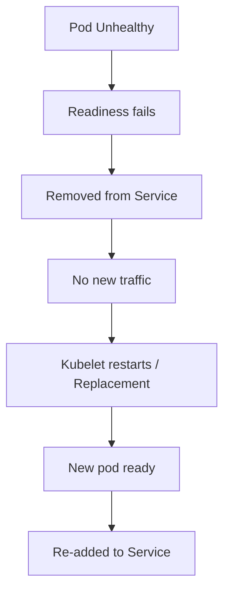

# High Availability for LLM Inference

## 1. Overview

**High Availability (HA)** aims for:

- **No single point of failure**
- **Automatic failover**
- **Target SLAs** (e.g. 99.9% uptime)

---

## 2. HA Architecture



---

## 3. Pod-Level HA

### 3.1 Minimum Replicas

```yaml
spec:
  replicas: 3  # Minimum for HA
  strategy:
    type: RollingUpdate
    rollingUpdate:
      maxSurge: 1
      maxUnavailable: 0  # Never go below desired
```

### 3.2 Pod Disruption Budget (PDB)

```yaml
apiVersion: policy/v1
kind: PodDisruptionBudget
metadata:
  name: triton-pdb
spec:
  minAvailable: 2
  selector:
    matchLabels:
      app: triton
```

Ensures at least 2 Triton pods stay running during voluntary disruptions (e.g. node drain).

### 3.3 Anti-Affinity

```yaml
affinity:
  podAntiAffinity:
    preferredDuringSchedulingIgnoredDuringExecution:
      - weight: 100
        podAffinityTerm:
          labelSelector:
            matchLabels:
              app: triton
          topologyKey: kubernetes.io/hostname
```

Prefers spreading Triton pods across different nodes.

---

## 4. Node-Level HA



**Topology spread:**

```yaml
topologySpreadConstraints:
  - maxSkew: 1
    topologyKey: topology.kubernetes.io/zone
    whenUnsatisfiable: ScheduleAnyway
    labelSelector:
      matchLabels:
        app: triton
```

---

## 5. Multi-AZ Deployment



- Deploy Triton in at least 2 AZs
- Use a regional load balancer to distribute traffic

---

## 6. Model Repository HA

| Storage | HA Strategy |
|---------|-------------|
| **NFS** | NFS cluster, failover |
| **PVC** | ReadOnlyMany, replicated storage (e.g. Ceph) |
| **Object (S3)** | Multi-AZ, versioning |
| **Init sync** | Sync from S3 to local; multiple pods can run sync |

---

## 7. Failure Detection & Recovery



**Probes:**

```yaml
livenessProbe:
  httpGet:
    path: /v2/health/live
    port: 8000
  initialDelaySeconds: 90
  periodSeconds: 10
  failureThreshold: 3

readinessProbe:
  httpGet:
    path: /v2/health/ready
    port: 8000
  initialDelaySeconds: 120
  periodSeconds: 10
  failureThreshold: 3
```

---

## 8. Graceful Shutdown

```yaml
lifecycle:
  preStop:
    exec:
      command: ["/bin/sh", "-c", "sleep 15"]
terminationGracePeriodSeconds: 60
```

- `preStop` sleep allows load balancer to stop sending traffic
- `terminationGracePeriodSeconds` allows in-flight requests to finish

---

## 9. HA Checklist

- [ ] `replicas >= 2`
- [ ] PodDisruptionBudget defined
- [ ] Anti-affinity / topology spread
- [ ] Multi-AZ deployment
- [ ] Liveness and readiness probes
- [ ] Graceful shutdown configured
- [ ] Model repo is highly available

---

## Next Steps

- [Monitoring & Observability](./03-monitoring-observability.md)
- [Cloud Deployment - AWS](../05-cloud-deployment/01-aws-sagemaker-neurons.md)
