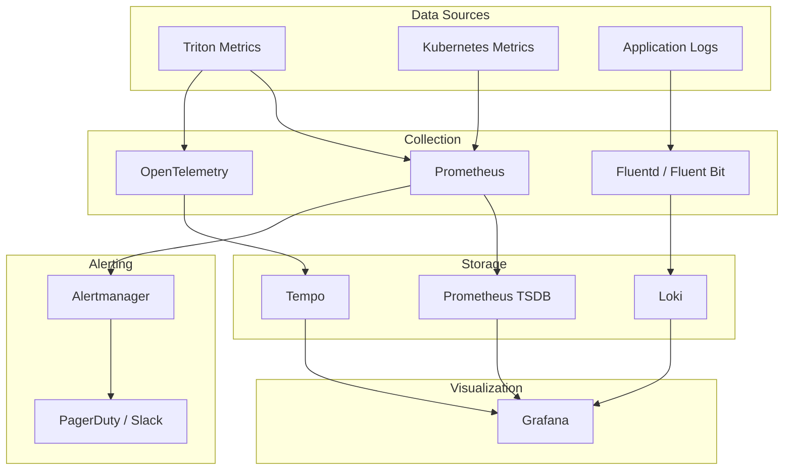
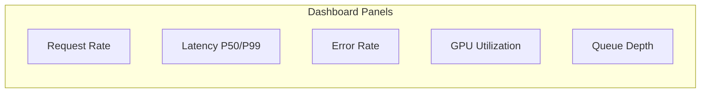
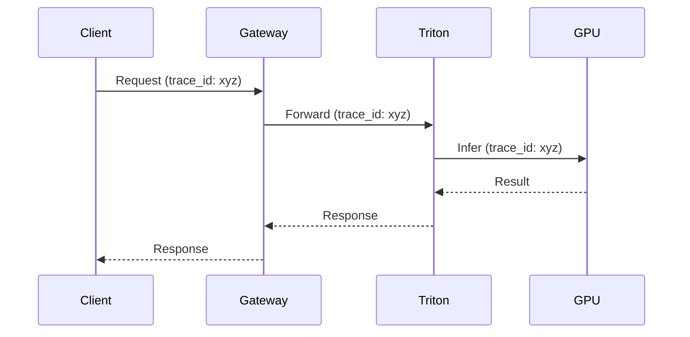

# AI Inference Monitoring & Observability

## 1. Overview

Observability for LLM inference typically covers:

- **Metrics** – Latency, throughput, errors, resource usage
- **Logs** – Request/response, errors, debug
- **Traces** – End-to-end request flow

---

## 2. Monitoring Architecture



---

## 3. Triton Metrics

### 3.1 Key Metrics

| Metric | Meaning |
|--------|---------|
| `nv_inference_request_success` | Successful inference count |
| `nv_inference_request_failure` | Failed inference count |
| `nv_inference_exec_count` | Executions |
| `nv_inference_queue_duration_us` | Time in queue (microseconds) |
| `nv_inference_compute_infer_duration_us` | Compute time |
| `nv_gpu_utilization` | GPU utilization (0–100) |
| `nv_gpu_memory_used_bytes` | GPU memory used |
| `nv_gpu_memory_total_bytes` | Total GPU memory |

### 3.2 Prometheus Scraping

```yaml
# ServiceMonitor for Prometheus Operator
apiVersion: monitoring.coreos.com/v1
kind: ServiceMonitor
metadata:
  name: triton-metrics
spec:
  selector:
    matchLabels:
      app: triton
  endpoints:
    - port: metrics
      interval: 15s
      path: /metrics
```

### 3.3 Grafana Dashboard Panels



**Example PromQL:**

```promql
# Request rate
rate(nv_inference_request_success[5m])

# P99 latency
histogram_quantile(0.99, rate(nv_inference_compute_infer_duration_us_bucket[5m]))
```

---

## 4. SLIs and SLOs

| SLI | Target (example) |
|-----|------------------|
| **Availability** | 99.9% successful requests |
| **Latency (P99)** | &lt; 2 s for completion |
| **Throughput** | 100 req/s sustained |

**Error budget:**

```
Error budget = 1 - SLO = 0.1% (99.9% → 43 min/month)
```

---

## 5. Alerting Rules

| Alert | Condition | Severity |
|-------|-----------|----------|
| High error rate | `rate(nv_inference_request_failure[5m]) > 0.01` | Critical |
| High latency | P99 &gt; 5s | Warning |
| GPU OOM risk | `nv_gpu_memory_used_bytes / nv_gpu_memory_total_bytes > 0.9` | Warning |
| No healthy pods | `count(up{job="triton"} == 1) < 2` | Critical |

---

## 6. Logging

**Structured log format:**
```json
{
  "timestamp": "2024-01-15T10:00:00Z",
  "level": "info",
  "model": "llama2_7b",
  "request_id": "abc-123",
  "latency_ms": 450,
  "batch_size": 4,
  "status": "success"
}
```

**Triton logging:**
```bash
tritonserver --model-repository=/models --log-verbose=1 --log-file=/var/log/triton.log
```

---

## 7. Distributed Tracing



- Use **OpenTelemetry** or **Jaeger** for trace collection
- Propagate `trace_id` and `span_id` across services

---

## 8. Runbook Integration

Link alerts to runbooks, e.g.:

| Alert | Runbook |
|-------|---------|
| High error rate | [Incident Management](../06-operational-runbooks/01-incident-management.md) |
| Model load failure | [Troubleshooting Triton](../01-triton-inference-server/04-troubleshooting.md) |
| GPU OOM | Scale down batch size, add instances |

---

## Next Steps

- [AWS Deployment](../05-cloud-deployment/01-aws-sagemaker-neurons.md)
- [GCP Deployment](../05-cloud-deployment/02-gcp-vertex-ai.md)
- [Incident Management](../06-operational-runbooks/01-incident-management.md)
