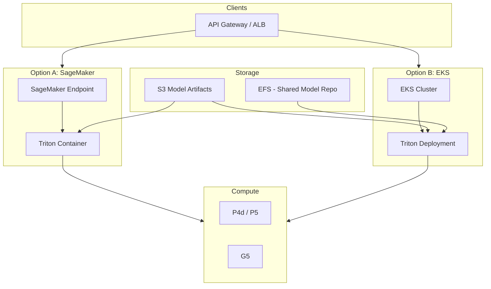
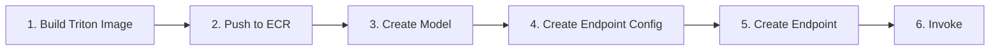
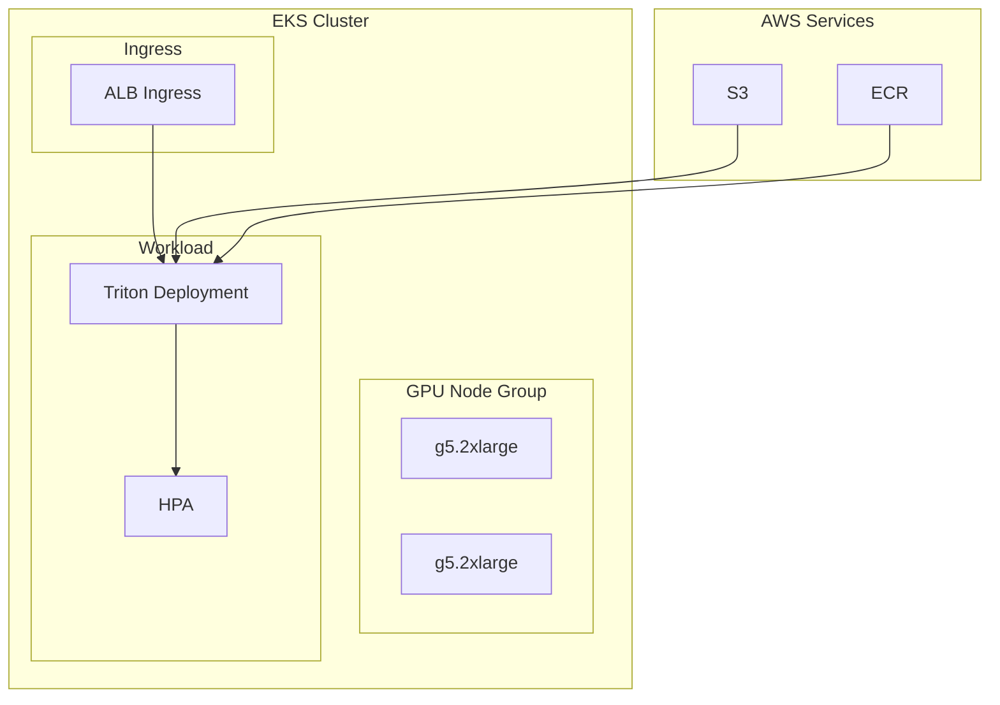

# AWS – SageMaker, Triton & Inferentia

## 1. Overview

AWS options for LLM inference:

| Option | Use Case | Notes |
|--------|----------|-------|
| **SageMaker Real-Time** | Managed Triton, custom containers | Full control, NVIDIA GPUs |
| **SageMaker Asynchronous** | Batch inference | Cost-effective for batch |
| **SageMaker Serverless** | Variable traffic | Pay per request |
| **EKS + Triton** | Custom deployment | Same as on-prem |
| **Own Triton on EC2** | Direct control | EC2 with GPU |

---

## 2. AWS LLM Inference Architecture



---

## 3. SageMaker with Triton

### 3.1 High-Level Flow



### 3.2 Create Model from Triton Container

```python
import sagemaker
from sagemaker import Model

# Triton container from NVIDIA DLC
triton_image = "763104351884.dkr.ecr.us-east-1.amazonaws.com/nvidia-tritonserver:24.01-py3"

model = Model(
    model_data="s3://bucket/model-repo/",  # Model artifacts
    image_uri=triton_image,
    role=role_arn,
    env={"SAGEMAKER_TRITON_DEFAULT_MODEL_NAME": "llama2_7b"}
)

# Deploy
predictor = model.deploy(
    instance_type="ml.g5.2xlarge",
    initial_instance_count=2,
    endpoint_name="llm-inference"
)
```

### 3.3 Model Artifacts Layout (S3)

```
s3://bucket/model-repo/
└── llama2_7b/
    ├── config.pbtxt
    └── 1/
        ├── model.py
        └── rank0.engine
```

---

## 4. EKS + Triton (Self-Managed)

### 4.1 Architecture



### 4.2 EKS GPU Node Group (Terraform)

```hcl
resource "aws_eks_node_group" "gpu" {
  cluster_name    = aws_eks_cluster.main.name
  node_group_name = "gpu"
  node_role_arn   = aws_iam_role.eks_node.arn
  subnet_ids      = aws_subnet.private[*].id
  instance_types = ["g5.2xlarge"]

  scaling_config {
    desired_size = 2
    max_size     = 10
    min_size     = 1
  }

  labels = {
    workload-type = "gpu-inference"
  }
}
```

### 4.3 Model Repo from S3

Use init container to sync S3 → local:

```yaml
initContainers:
  - name: model-sync
    image: amazon/aws-cli
    command:
      - aws
      - s3
      - sync
      - s3://bucket/model-repo/
      - /models
    volumeMounts:
      - name: models
        mountPath: /models
```

---

## 5. API Design – Invoke Endpoint

### 5.1 SageMaker Invoke

```python
import boto3
import json

runtime = boto3.client("sagemaker-runtime")

response = runtime.invoke_endpoint(
    EndpointName="llm-inference",
    ContentType="application/json",
    Body=json.dumps({
        "inputs": "What is TensorRT?",
        "parameters": {
            "max_tokens": 256,
            "temperature": 0.7
        }
    })
)

result = json.loads(response["Body"].read())
```

### 5.2 Async Invoke (Long-Running)

```python
response = runtime.invoke_endpoint_async(
    EndpointName="llm-inference",
    ContentType="application/json",
    InputLocation="s3://bucket/input/request.json",
    OutputLocation="s3://bucket/output/"
)
# Poll for completion or use callback
```

---

## 6. Autoscaling on AWS

### 6.1 SageMaker Auto-Scaling

```python
sagemaker_client = boto3.client("sagemaker")

sagemaker_client.put_scaling_policy(
    EndpointName="llm-inference",
    ResourceId="endpoint/llm-inference/variant/AllTraffic",
    ScalableDimension="sagemaker:variant:DesiredInstanceCount",
    PolicyName="InferenceScaling",
    PolicyType="TargetTrackingScaling",
    TargetTrackingScalingPolicyConfiguration={
        "TargetValue": 70.0,
        "PredefinedMetricSpecification": {
            "PredefinedMetricType": "SageMakerVariantInvocationsPerInstance"
        },
        "ScaleInCooldown": 300,
        "ScaleOutCooldown": 60
    }
)
```

### 6.2 EKS Cluster Autoscaler

- GPU node group scales on pending pods
- HPA scales Triton deployment

---

## 7. Cost Optimization

| Strategy | How |
|----------|-----|
| **Spot instances** | Use Spot for training; consider for inference if fault-tolerant |
| **Savings Plans** | Commit to GPU compute for steady load |
| **Right-sizing** | Start with g5.2xlarge; scale to g5.12xlarge if needed |
| **Serverless** | Use SageMaker Serverless for spiky traffic |

---

## 8. Checklist

- [ ] Triton image in ECR or use NVIDIA DLC
- [ ] Model artifacts in S3
- [ ] IAM roles for SageMaker/EKS
- [ ] VPC, subnets, security groups
- [ ] Autoscaling configured
- [ ] CloudWatch metrics and alarms

---

## Next Steps

- [GCP Vertex AI](./02-gcp-vertex-ai.md)
- [API Design Patterns](./03-api-design-patterns.md)
