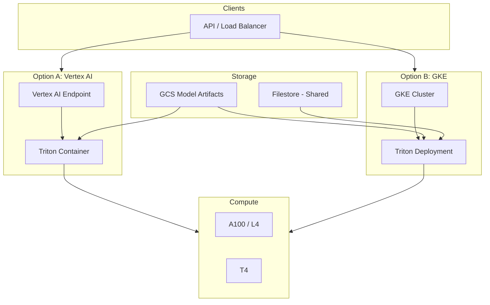
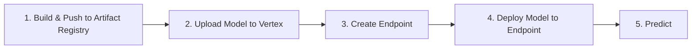

# GCP – Vertex AI & Triton

## 1. Overview

GCP options for LLM inference:

| Option | Use Case | Notes |
|--------|----------|-------|
| **Vertex AI Prediction** | Custom containers (Triton) | Managed, autoscaling |
| **Vertex AI Model Garden** | Pre-built models | Quick start |
| **GKE + Triton** | Full control | Same as on-prem/K8s |
| **Vertex AI Endpoints** | Unified API | Supports custom predict) |

---

## 2. GCP LLM Inference Architecture



---

## 3. Vertex AI with Custom Triton Container

### 3.1 Flow



### 3.2 Create Model (Triton Container)

```python
from google.cloud import aiplatform

aiplatform.init(project="my-project", location="us-central1")

# Upload model from GCS
model = aiplatform.Model.upload_scikit_learn_model_file(
    display_name="llama2_7b",
    serving_container_image_uri="us-docker.pkg.dev/cloud-aiplatform/prediction/triton-predict:latest",
    artifact_uri="gs://bucket/model-repo/"
)
```

### 3.3 Deploy to Endpoint

```python
endpoint = aiplatform.Endpoint.create(display_name="llm-endpoint")

endpoint.deploy(
    model=model,
    deployed_model_display_name="llama2_7b",
    machine_type="a2-highgpu-1g",
    min_replica_count=1,
    max_replica_count=5,
    accelerator_type="NVIDIA_TESLA_A100",
    accelerator_count=1
)
```

### 3.4 Predict

```python
response = endpoint.predict(instances=[{
    "prompt": "What is TensorRT?",
    "max_tokens": 256
}])
```

---

## 4. GKE + Triton

### 4.1 GKE GPU Node Pool

```bash
gcloud container node-pools create gpu-pool \
  --cluster=my-cluster \
  --zone=us-central1-a \
  --machine-type=n1-standard-8 \
  --accelerator=type=nvidia-tesla-a100,count=1 \
  --num-nodes=2 \
  --min-nodes=1 \
  --max-nodes=10 \
  --enable-autoscaling
```

### 4.2 Model Repo from GCS

```yaml
initContainers:
  - name: gcs-sync
    image: google/cloud-sdk
    command:
      - gsutil
      - -m
      - rsync
      - -r
      - gs://bucket/model-repo/
      - /models
    volumeMounts:
      - name: models
        mountPath: /models
```

### 4.3 Filestore for Shared Model Repo

- Create Filestore instance
- Mount as ReadOnlyMany in Triton pods
- Sync models via CI/CD or init job

---

## 5. Vertex AI vs GKE – When to Use

| Factor | Vertex AI | GKE |
|--------|-----------|-----|
| **Management** | Fully managed | Self-managed |
| **Flexibility** | Less | Full |
| **Ops overhead** | Low | Higher |
| **Cost** | Per prediction + machine | Per machine |
| **Customization** | Container limits | Full K8s |

---

## 6. GCP API Design

### 6.1 Vertex AI REST API

```http
POST https://{region}-aiplatform.googleapis.com/v1/projects/{project}/locations/{region}/endpoints/{endpoint_id}:predict
Content-Type: application/json

{
  "instances": [
    {"prompt": "Hello", "max_tokens": 100}
  ],
  "parameters": {
    "temperature": 0.7
  }
}
```

### 6.2 Authentication

```python
from google.auth import default
from google.cloud import aiplatform

credentials, project = default()
aiplatform.init(credentials=credentials, project=project)
```

---

## 7. Autoscaling

- **Vertex AI**: Automatic per-endpoint scaling
- **GKE**: HPA + Cluster Autoscaler for GPU node pool

---

## 8. Checklist

- [ ] Triton image in Artifact Registry
- [ ] Model artifacts in GCS
- [ ] Service account with Vertex AI roles
- [ ] VPC, firewall rules
- [ ] Monitoring (Cloud Monitoring)

---

## Next Steps

- [API Design Patterns](./03-api-design-patterns.md)
- [Incident Management](../06-operational-runbooks/01-incident-management.md)
