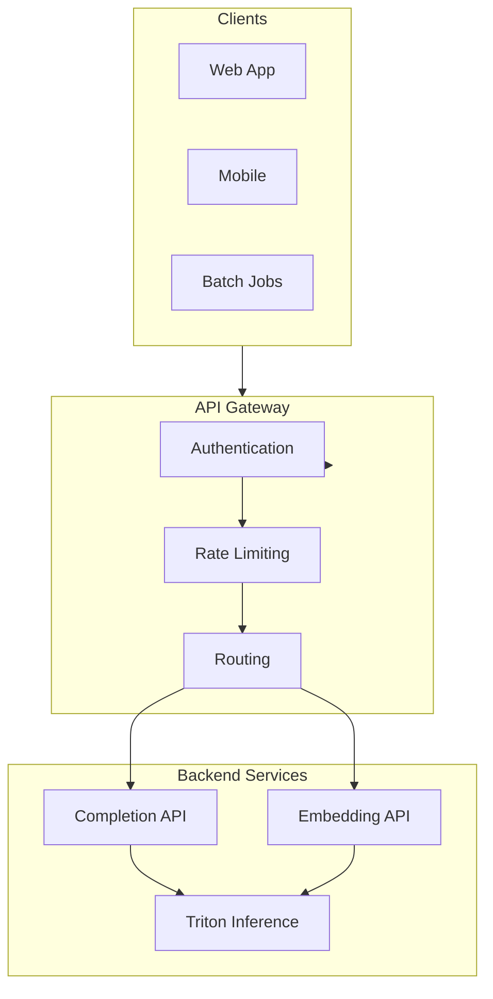
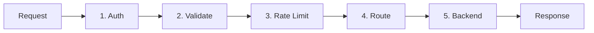
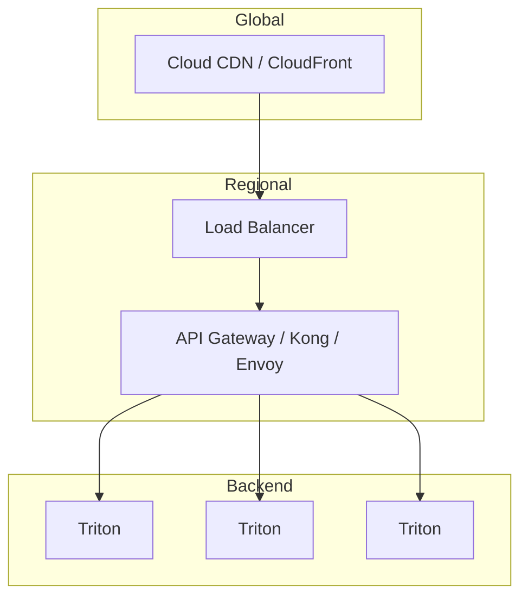

# API Design for LLM Inference Services

## 1. Overview

APIs for LLM inference should support:

- **Completion** – Text generation
- **Embedding** – Vector embeddings
- **Streaming** – Token-by-token output
- **Batch** – Bulk inference
- **Health** – Readiness, liveness

---

## 2. API Architecture



---

## 3. API Patterns

### 3.1 Completion (Non-Streaming)

```http
POST /v1/completions
Content-Type: application/json

{
  "model": "llama2_7b",
  "prompt": "Explain quantum computing in one sentence.",
  "max_tokens": 100,
  "temperature": 0.7,
  "stop": ["\n", "."]
}
```

**Response:**
```json
{
  "id": "cmpl-123",
  "choices": [
    {
      "text": "Quantum computing uses quantum mechanics...",
      "finish_reason": "stop"
    }
  ],
  "usage": {
    "prompt_tokens": 10,
    "completion_tokens": 25,
    "total_tokens": 35
  }
}
```

### 3.2 Completion (Streaming)

```http
POST /v1/completions
Content-Type: application/json
Accept: text/event-stream

{
  "model": "llama2_7b",
  "prompt": "Write a haiku about AI.",
  "stream": true
}
```

**Response (SSE):**
```
data: {"choices":[{"text":"Artificial","finish_reason":null}]}
data: {"choices":[{"text":" minds","finish_reason":null}]}
...
data: [DONE]
```

### 3.3 Embedding

```http
POST /v1/embeddings
Content-Type: application/json

{
  "model": "embedding-model",
  "input": ["text to embed", "another text"]
}
```

**Response:**
```json
{
  "data": [
    {"embedding": [0.1, -0.2, ...], "index": 0},
    {"embedding": [0.3, 0.1, ...], "index": 1}
  ],
  "usage": {"total_tokens": 20}
}
```

---

## 4. API Gateway Responsibilities



| Responsibility | Implementation |
|----------------|----------------|
| **Auth** | API key, JWT, OAuth |
| **Validate** | Schema validation (JSON Schema) |
| **Rate limit** | Per-user, per-model, per-endpoint |
| **Route** | Path → backend service |
| **Metrics** | Request count, latency, errors |

---

## 5. Versioning Strategy

| Approach | Example |
|----------|---------|
| **URL path** | `/v1/completions`, `/v2/completions` |
| **Header** | `Accept: application/vnd.api+json;version=2` |
| **Query** | `?version=2` |

**Recommended:** URL path (`/v1/`, `/v2/`) for clarity and caching.

---

## 6. Error Handling

| HTTP Code | Meaning |
|-----------|---------|
| 400 | Bad request (malformed JSON, invalid params) |
| 401 | Unauthorized |
| 429 | Rate limited |
| 503 | Service unavailable (Triton overloaded, model loading) |
| 504 | Gateway timeout (Triton too slow) |

**Error response format:**
```json
{
  "error": {
    "code": "rate_limit_exceeded",
    "message": "Rate limit exceeded. Retry after 60 seconds.",
    "retry_after": 60
  }
}
```

---

## 7. Scalable API Infrastructure



---

## 8. Managing Scalable Infrastructure

### 8.1 API Layer Scaling

- **Stateless** – Horizontal scaling
- **Connection pooling** – To Triton backends
- **Circuit breaker** – Fail fast when Triton is down

### 8.2 Backend Scaling

- **HPA** – Scale Triton pods by CPU/GPU/metrics
- **Cluster autoscaler** – Add GPU nodes when needed
- **Multi-region** – For global latency

### 8.3 Caching (Where Applicable)

- **Embeddings** – Cache by input hash
- **Completions** – Generally not cacheable (dynamic)

---

## 9. OpenAPI / AsyncAPI

Provide OpenAPI spec for clients:

```yaml
openapi: 3.0.0
info:
  title: LLM Inference API
  version: 1.0.0
paths:
  /v1/completions:
    post:
      summary: Create completion
      requestBody:
        content:
          application/json:
            schema:
              $ref: '#/components/schemas/CompletionRequest'
      responses:
        '200':
          description: Successful completion
```

---

## Next Steps

- [Operational Runbooks – Incident Management](../06-operational-runbooks/01-incident-management.md)
- [Change Management](../06-operational-runbooks/02-change-management.md)
