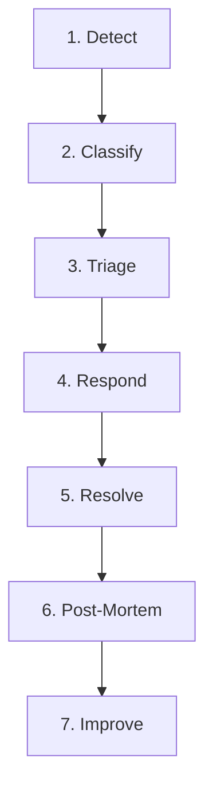
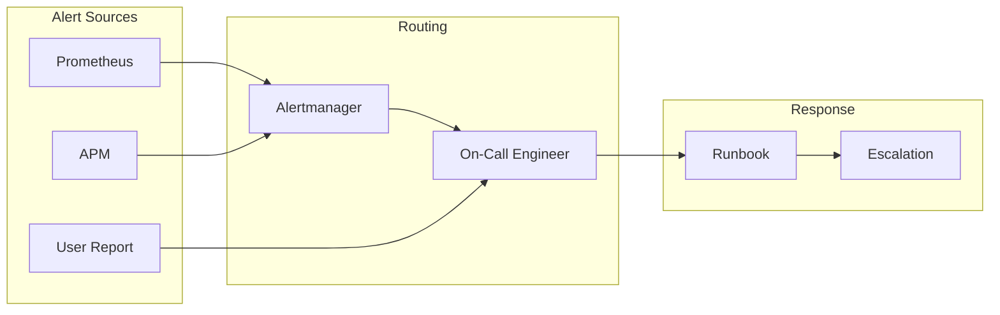
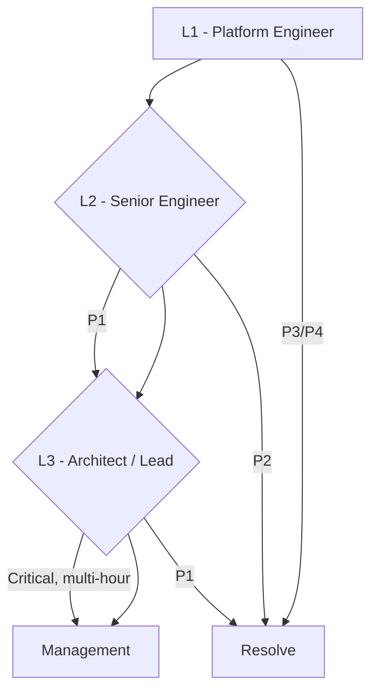

# Incident Management for Mission-Critical AI Systems

## 1. Overview

**Incident management** covers detection, response, resolution, and post-mortem for AI inference failures.

---

## 2. Incident Lifecycle

---

## 3. Severity Classification

| Severity | Description | Response Time |
|----------|-------------|---------------|
| **P1 – Critical** | Complete outage, SLA breach | &lt; 15 min |
| **P2 – High** | Significant degradation, high error rate | &lt; 1 hr |
| **P3 – Medium** | Degraded performance, partial failure | &lt; 4 hr |
| **P4 – Low** | Minor issue, workaround available | Next business day |

---

## 4. Detection & Alerting Flow

---

## 5. Common Incident Types & Runbooks

### 5.1 Triton Model Unavailable

| Step | Action |
|------|--------|
| 1 | Check `kubectl get pods -l app=triton` |
| 2 | Check Triton logs: `kubectl logs <pod> -c triton` |
| 3 | Verify model repo mounted and readable |
| 4 | Check GPU: `nvidia-smi` in pod |
| 5 | Restart deployment if OOM or crash loop |
| 6 | Escalate if model load failure persists |

### 5.2 High Latency / Timeout

| Step | Action |
|------|--------|
| 1 | Check queue depth: `nv_inference_queue_duration_us` |
| 2 | Check GPU utilization |
| 3 | Consider scaling up (add pods) |
| 4 | Reduce batch size or queue delay |
| 5 | Check for noisy neighbor (other workloads on same node) |

### 5.3 High Error Rate

| Step | Action |
|------|--------|
| 1 | Check `nv_inference_request_failure` by model |
| 2 | Review recent deployments or config changes |
| 3 | Rollback model version if recently updated |
| 4 | Check input validation – malformed requests |
| 5 | Check GPU memory (OOM can cause failures) |

### 5.4 GPU OOM

| Step | Action |
|------|--------|
| 1 | Reduce `max_batch_size` in model config |
| 2 | Reduce number of instances per GPU |
| 3 | Consider quantization (FP8/INT8) |
| 4 | Scale horizontally (more pods, fewer instances each) |

---

## 6. Escalation Matrix

---

## 7. Communication

| Audience | Channel | Content |
|---------|---------|---------|
| **Engineering** | Slack #incidents | Status, actions, ETA |
| **Stakeholders** | Email / Status page | High-level impact, ETA |
| **Management** | Escalation call | P1, extended outage |

---

## 8. Post-Incident Review (PIR)

**Template:**

1. **Timeline** – Detection → resolution
2. **Root cause** – Primary and contributing factors
3. **Impact** – Users, SLA, revenue
4. **What went well** – Response, tools
5. **What went wrong** – Gaps, delays
6. **Action items** – Prevent recurrence, improve runbooks

---

## 9. Checklist

- [ ] Severity assigned
- [ ] On-call notified
- [ ] Runbook executed
- [ ] Stakeholders informed
- [ ] Root cause documented
- [ ] PIR scheduled within 48 hours
- [ ] Action items tracked

---

## Next Steps

- [Change Management](./02-change-management.md)
- [Event Management](./03-event-management.md)
- [Triton Troubleshooting](../01-triton-inference-server/04-troubleshooting.md)
