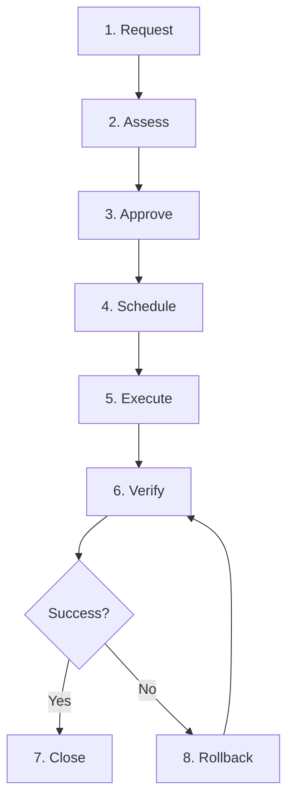
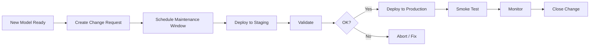
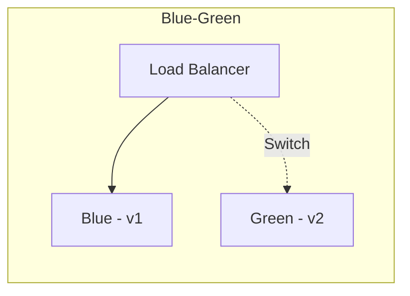

# Change Management for Mission-Critical AI Systems

## 1. Overview

**Change management** ensures controlled, tracked, and reversible updates to AI inference systems.

---

## 2. Change Types

| Type | Risk | Approval | Example |
|------|------|----------|---------|
| **Standard** | Low | Pre-approved | Config tweak, non-critical |
| **Normal** | Medium | Change advisory | New model version, scaling change |
| **Emergency** | High | Expedited | Hotfix, security patch |

---

## 3. Change Lifecycle

---

## 4. Model Deployment Change

---

## 5. Pre-Change Checklist

- [ ] Change request documented
- [ ] Rollback plan defined
- [ ] Backup / previous version available
- [ ] Maintenance window communicated
- [ ] On-call notified
- [ ] Monitoring dashboards ready

---

## 6. Rollback Procedure

| Scenario | Rollback Action |
|----------|-----------------|
| **Bad model version** | Load previous version: `POST /v2/repository/models/{model}/load` with prior version |
| **Config change** | Revert config.pbtxt, reload model |
| **Triton upgrade** | Rollback deployment to previous image |
| **K8s deployment** | `kubectl rollout undo deployment/triton` |

---

## 7. Zero-Downtime Deployments

**Strategy:**

1. Deploy new version (Green) alongside current (Blue)
2. Validate Green
3. Shift traffic to Green
4. Retire Blue

---

## 8. Change Windows

| Window | Use Case |
|--------|----------|
| **Business hours** | Low-risk, need validation during day |
| **Off-hours** | Higher risk, minimize user impact |
| **Planned maintenance** | Major upgrades, communicate in advance |

---

## 9. Documentation

**Change record:**

- Change ID
- Description
- Risk level
- Approval
- Execution steps
- Verification steps
- Rollback steps
- Outcome

---

## Next Steps

- [Event Management](./03-event-management.md)
- [Incident Management](./01-incident-management.md)
