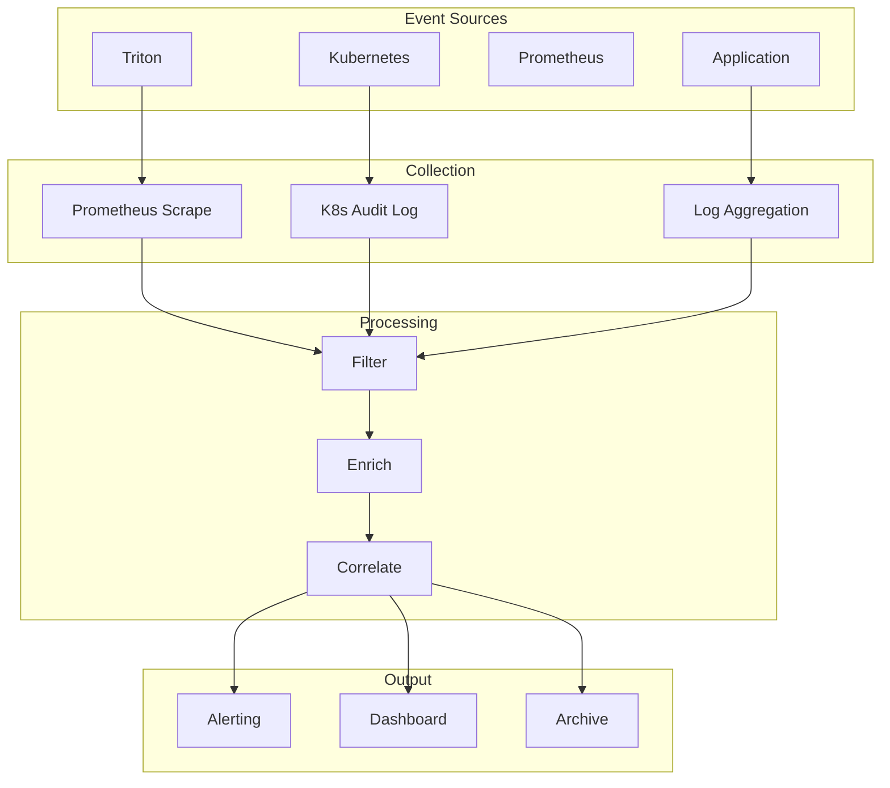
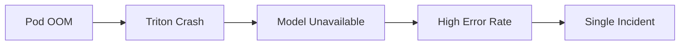
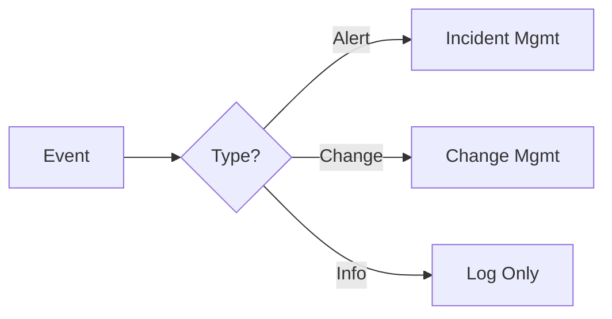

# Event Management for Mission-Critical AI Systems

## 1. Overview

**Event management** handles alerts, logs, and state changes to support proactive operations.

---

## 2. Event Types

| Type | Source | Example |
|------|--------|---------|
| **Alert** | Prometheus, APM | High error rate, GPU OOM |
| **Log** | Triton, application | Error log, debug |
| **State change** | Kubernetes | Pod restarted, node not ready |
| **Metric** | Custom | Threshold exceeded |

---

## 3. Event Flow



---

## 4. Event Correlation

**Correlated events** – e.g. same root cause:

- Pod OOM → Triton crash → Model unavailable
- Node drain → Pod eviction → Reduced capacity
- Model load failure → High error rate



---

## 5. Event Response Matrix

| Event | Severity | Action |
|-------|----------|--------|
| Triton pod not ready | High | Investigate, check logs |
| GPU utilization &gt; 95% | Medium | Monitor, consider scale |
| Model load failed | Critical | Run incident runbook |
| Node not ready | High | Check node, drain if needed |
| High queue depth | Medium | Consider scaling |

---

## 6. Alert Tuning

**Reduce noise:**

- Use meaningful thresholds
- Add `for` duration (e.g. 5m) to avoid flapping
- Group related alerts
- Suppress during known maintenance

**Example Prometheus rule:**

```yaml
- alert: TritonHighErrorRate
  expr: rate(nv_inference_request_failure[5m]) > 0.01
  for: 5m
  labels:
    severity: critical
  annotations:
    summary: "Triton high error rate"
    runbook: "https://docs/runbooks/triton-errors"
```

---

## 7. Event Retention

| Event Type | Retention |
|------------|-----------|
| Alerts | 90 days |
| Metrics | 30–90 days (depends on storage) |
| Logs | 30 days hot, 1 year cold |
| Audit | Per compliance (e.g. 1 year) |

---

## 8. Integration with Incident & Change



- **Alert** → Create or update incident
- **Deployment event** → Link to change record
- **Info** → Log, no immediate action

---

## Next Steps

- [Incident Management](./01-incident-management.md)
- [Change Management](./02-change-management.md)
- [Monitoring & Observability](../04-scaling-availability/03-monitoring-observability.md)
