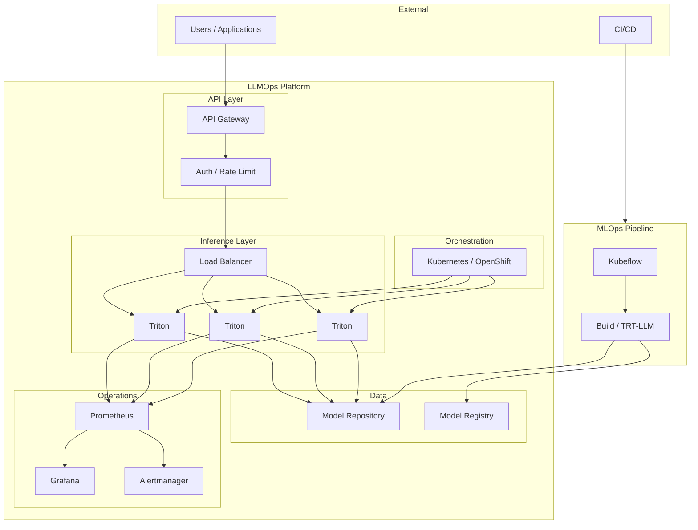
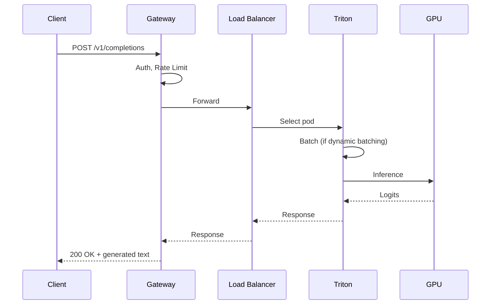

# Architecture Overview – End-to-End LLMOps Platform

## 1. System Context



---

## 2. Data Flow: Request to Response



---

## 3. Data Flow: Model Deployment

```mermaid
flowchart LR
    subgraph Dev["Development"]
        Train[Train / Fine-tune]
        Eval[Evaluate]
        Register[Register Model]
        Train --> Eval --> Register
    end

    subgraph Build["Build"]
        Convert[Convert to TRT-LLM]
        Build[Build Engine]
        Convert --> Build
    end

    subgraph Deploy["Deploy"]
        Sync[Sync to Model Repo]
        Load[Triton Load]
        Validate[Smoke Test]
        Sync --> Load --> Validate
    end

    subgraph Operate["Operate"]
        Monitor[Monitor]
        Scale[Scale]
        Respond[Incident Response]
    end

    Register --> Convert
    Build --> Sync
    Validate --> Monitor
    Monitor --> Scale
    Monitor --> Respond
```

---

## 4. Deployment Topologies

### 4.1 On-Prem (NVIDIA DGX / HGX)

```
[Cluster] → GPU Operator → K8s/OpenShift → Triton → NFS/GPFS Model Repo
```

### 4.2 AWS

```
[EKS] → GPU Node Group → Triton → S3 (sync) / EFS
[SageMaker] → Managed Endpoint → Triton Container → S3
```

### 4.3 GCP

```
[GKE] → GPU Node Pool → Triton → GCS (sync) / Filestore
[Vertex AI] → Custom Container → Triton → GCS
```

---

## 5. Technology Stack Summary

| Layer | Technologies |
|-------|--------------|
| **Inference** | Triton, TensorRT-LLM |
| **Orchestration** | Kubernetes, OpenShift |
| **Pipeline** | Kubeflow, Argo Workflows |
| **Monitoring** | Prometheus, Grafana |
| **Cloud** | AWS (SageMaker, EKS), GCP (Vertex AI, GKE) |

---

## 6. Document Map

| Phase | Documents |
|-------|-----------|
| **Understand** | Architecture, When/What/How |
| **Build** | TensorRT-LLM, Optimization |
| **Deploy** | Configuration, K8s, Cloud |
| **Scale** | Load Balancing, HA, Monitoring |
| **Operate** | Incident, Change, Event |

---

See [README](README.md) and [Quick Reference](QUICK-REFERENCE.md) for navigation.
