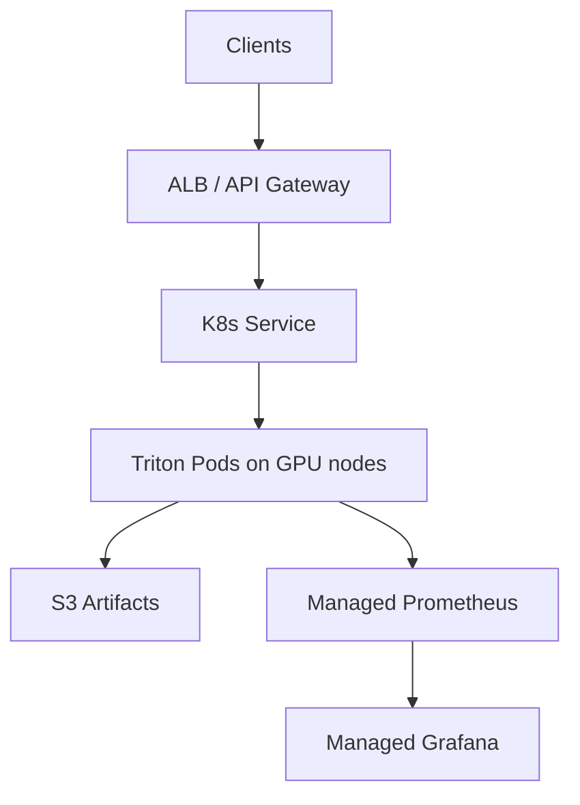

# AWS (EKS) — Scalable LLM Inference Platform

## Components
- EKS + OIDC
- GPU node group (g5/p4/p5) + NVIDIA plugin/operator
- ALB (API) + optionally NLB (high-throughput gRPC)
- S3 (versioned artifacts), optional EFS/EBS cache
- Observability: AMP/AMG or CloudWatch

## Diagram

