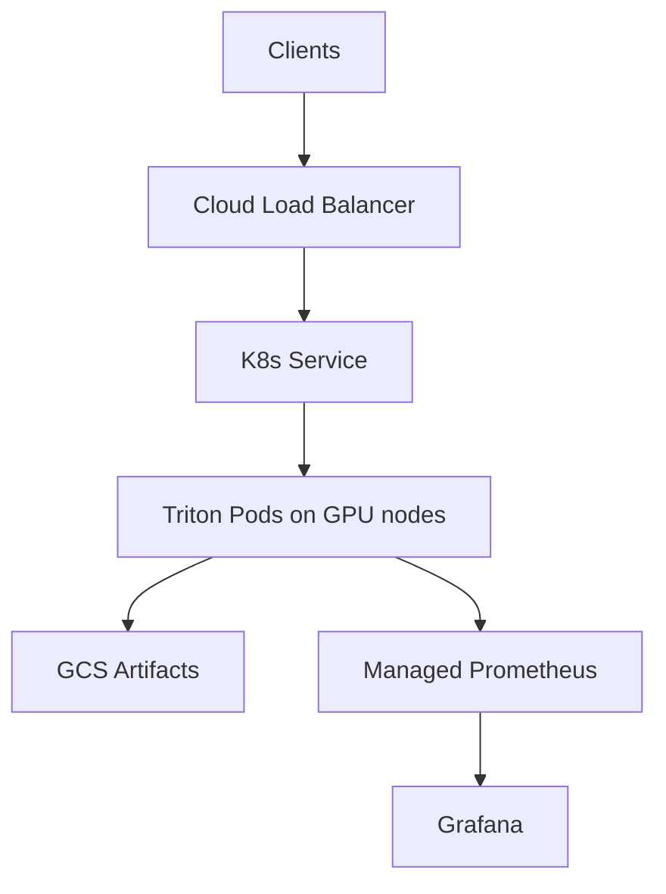

# GCP (GKE) — Scalable LLM Inference Platform

## Components
- GKE (regional preferred)
- GPU node pool + NVIDIA drivers/plugin
- Cloud Load Balancing / Gateway
- GCS (versioned artifacts), optional Filestore cache
- Monitoring: Managed Service for Prometheus + Cloud Logging

## Diagram

