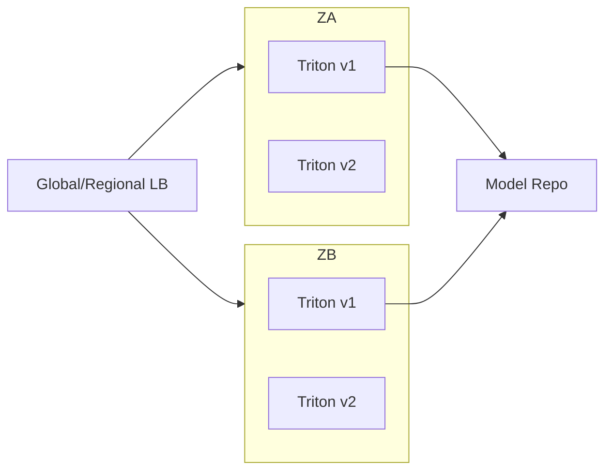

# HA / Multi-zone

```mermaid
flowchart LR
  GLB[Global/Regional LB] --> ZA[Zone A]
  GLB --> ZB[Zone B]
  subgraph ZA
    A1[Triton v1]
    A2[Triton v2]
  end
  subgraph ZB
    B1[Triton v1]
    B2[Triton v2]
  end
  A1 --> MR[Model Repo]
  B1 --> MR
```
