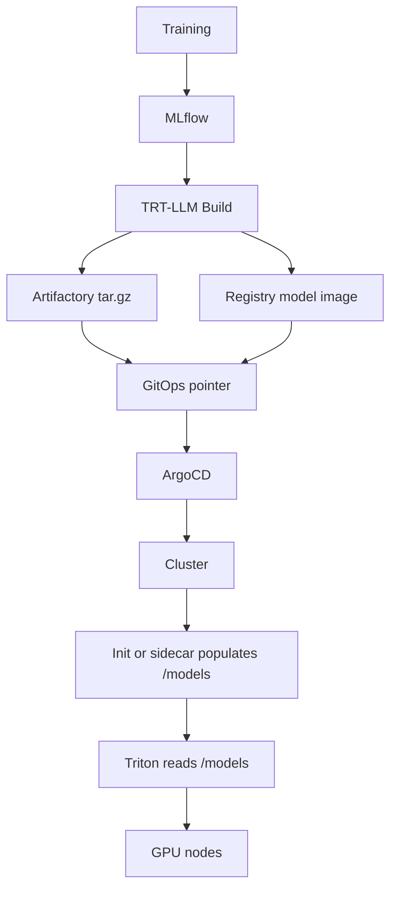

# Registry/Artifactory pattern

```mermaid
flowchart TB
  DEV[Training] --> MLF[MLflow]
  MLF --> BLD[TRT-LLM Build]
  BLD --> ART[Artifactory tar.gz]
  BLD --> REG[Registry model image]
  ART --> GIT[GitOps pointer]
  REG --> GIT
  GIT --> ARGO[ArgoCD]
  ARGO --> CL[Cluster]
  CL --> INIT[Init or sidecar populates /models]
  INIT --> TRI[Triton reads /models]
  TRI --> GPU[GPU nodes]
```
