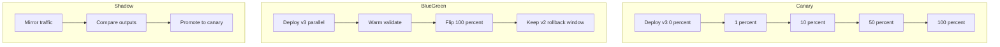

# Release strategies

```mermaid
flowchart TB
  subgraph Canary
    C1[Deploy v3 0 percent] --> C2[1 percent]
    C2 --> C3[10 percent]
    C3 --> C4[50 percent]
    C4 --> C5[100 percent]
  end

  subgraph BlueGreen
    B1[Deploy v3 parallel] --> B2[Warm validate]
    B2 --> B3[Flip 100 percent]
    B3 --> B4[Keep v2 rollback window]
  end

  subgraph Shadow
    S1[Mirror traffic] --> S2[Compare outputs]
    S2 --> S3[Promote to canary]
  end
```
