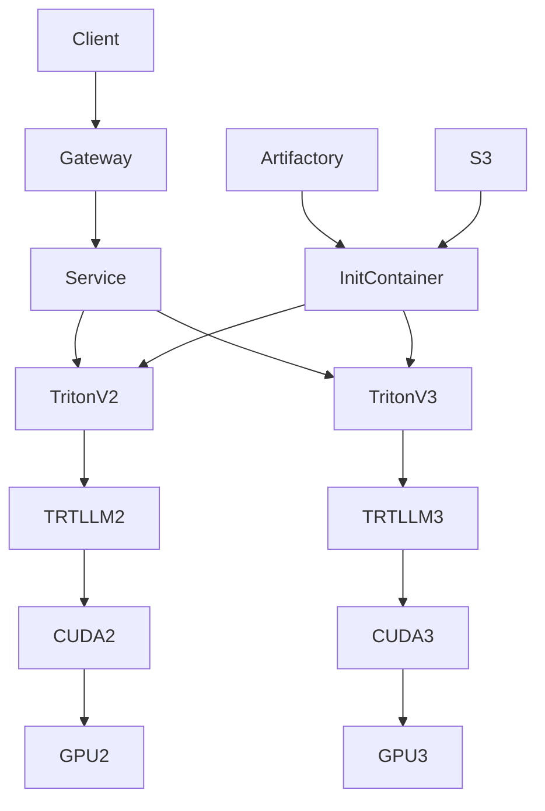

# 01 Architecture

## Overview

## Components

- Kubernetes/OpenShift scheduler: schedules Triton pods onto GPU nodes
- Triton: schedules inference requests, batching, concurrency
- TensorRT-LLM: optimized inference runtime
- CUDA: GPU execution runtime
- Artifactory/S3: artifact distribution
