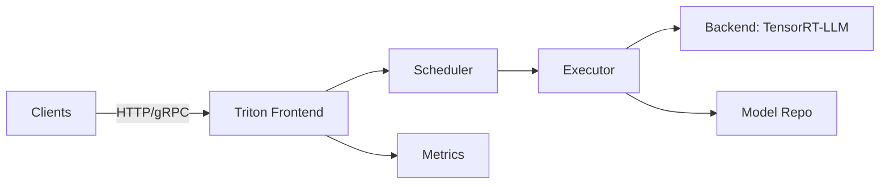

# 02 — Triton Inference Server (Deep Dive)

## 1) What Triton gives you in production
- Standardized endpoints: HTTP + gRPC (+ streaming patterns depending on your integration)
- Model lifecycle: load/unload, multi-version, warmup
- Scheduling: dynamic batching, concurrency control, instance groups
- Metrics: queue time, compute time, request counts, per-model timing
- Multi-model serving: host several models if GPU memory allows

Why it matters:
- You avoid writing (and maintaining) a fragile custom serving layer.
- You gain observability hooks that map to SLO monitoring.

## 2) Triton internal architecture

## 3) Model repository: design choices (step-by-step)

### Option A: PVC mounted model repo (ODF-backed)
**How**
- Create PVC (RBD/CephFS)
- Mount at /models
- Put versioned directories per model

**Pros**
- Fast load times
- Simple runtime

**Cons**
- Multi-zone behavior depends on storage class
- Shared FS semantics can surprise; prefer immutable versions

### Option B: Object storage model repo (S3/NooBaa/GCS)
**How**
- Store versioned objects
- Init container downloads required version to emptyDir (pod-local cache)
- Triton points to cache dir

**Pros**
- Portable, DR-friendly
- Immutable versioning is natural

**Cons**
- Startup time if cache not warm
- Need cache strategy

## 4) Key Triton knobs and how to tune (methodical)

### A) Dynamic batching
Goal: increase tokens/sec per GPU while bounding queue delay.

Steps:
1. Start with max_batch_size = 1 and measure baseline latency/throughput
2. Enable dynamic batching with preferred batch sizes [1,2,4,8]
3. Set max_queue_delay_microseconds low (e.g., 1000–3000) to protect p99
4. Load test at target RPS and tune batch sizes

### B) Instance groups
Goal: increase parallelism and utilization.

Steps:
1. Start 1 instance per GPU
2. Observe GPU utilization and p99
3. Increase instance count until p99 worsens or memory headroom collapses

### C) Concurrency
Goal: avoid GPU idle (too low) and queue spikes (too high).

Steps:
1. Measure queue time vs compute time
2. If queue dominates: scale out or reduce concurrency
3. If compute dominates and GPU idle: raise concurrency/batching

## 5) Health/Readiness (must be production-grade)
- Liveness: process is alive
- Readiness: model loaded and a cheap inference works
- Add alerts for: model load failures + prolonged not-ready state

## 6) Deployment patterns
- Blue/Green, Canary, Shadow (see runbooks/02-deployment-strategies.md)
