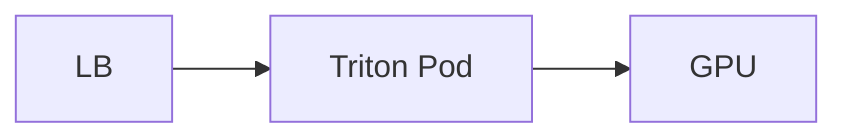
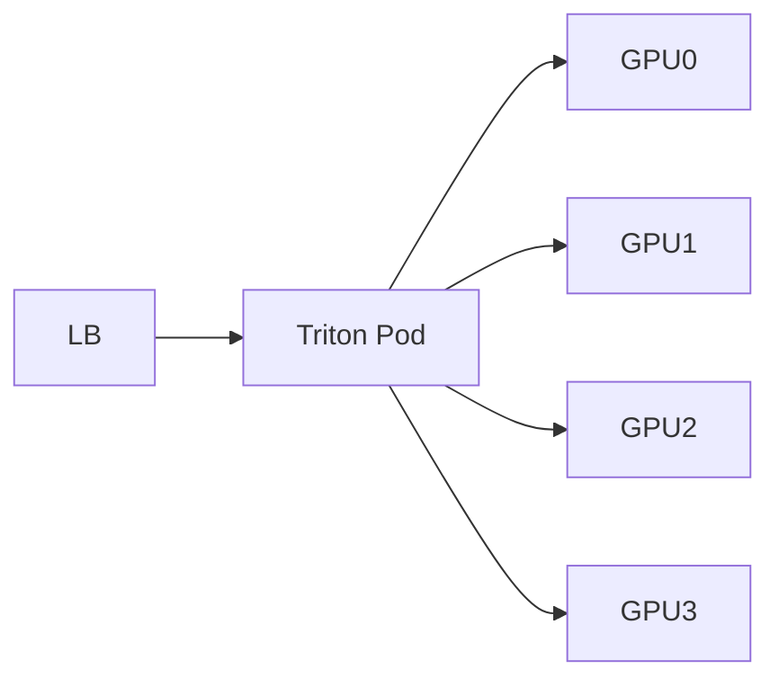
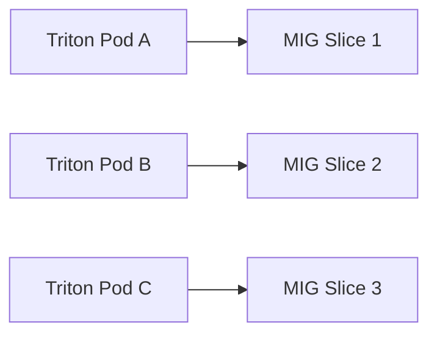

# 03 GPU Sharding, Multi-Instance, and Scaling Patterns (Triton + TensorRT-LLM)

Generated: 2026-02-19T18:37:36.566358Z

This document explains what people mean by:
- GPU sharding (tensor/pipeline parallel)
- multi-instance (Triton instances, model replicas)
- MIG (Multi-Instance GPU) and GPU partitioning
- multi-GPU vs multi-node inference

---

## 1) Terms you’ll hear (and what they actually mean)

### A) “GPU sharding”
Splitting **one model** across **multiple GPUs** because it is too large or you want higher throughput.
Common forms:
- **Tensor Parallel (TP)**: split matrix multiplications across GPUs (most common for LLMs)
- **Pipeline Parallel (PP)**: split model layers across GPUs (less common for low-latency)
- **Sequence Parallel / KV cache sharding**: optimizations around attention/cache

> In practice for TRT-LLM: “sharding” usually means **Tensor Parallel**.

### B) “Multi-instance” (two different meanings)
1) **Triton model instances**: multiple copies of the model runtime inside one Triton server process (same pod)
2) **Kubernetes replicas**: multiple Triton pods

### C) MIG (Multi-Instance GPU)
A single physical GPU is partitioned into multiple isolated GPU slices.
Kubernetes then schedules pods onto MIG devices as if they were GPUs.

---

## 2) The 4 most common production patterns

### Pattern 1 — 1 Triton pod : 1 GPU (default)
- simplest
- scales horizontally (add pods/GPU nodes)



### Pattern 2 — 1 Triton pod : N GPUs (single model sharded via TP)
Use when:
- model needs >1 GPU memory
- you want to keep an LLM instance together



Notes:
- Kubernetes allocates N GPUs to the pod
- TRT-LLM uses NCCL/CUDA to coordinate across GPUs

### Pattern 3 — MIG slices (more tenants / smaller models)
Use when:
- many smaller models / strict tenant isolation
- want better GPU packing



### Pattern 4 — Multiple Triton instances per GPU (careful)
Use when:
- you need parallel model execution
- but you must avoid GPU memory oversubscription

You control this with Triton `instance_group` and concurrency.

---

## 3) How Triton instances work (inside one pod)

In `config.pbtxt`:

```protobuf
instance_group [
  { kind: KIND_GPU count: 2 }
]
dynamic_batching { max_batch_size: 8 }
```

Meaning:
- 2 model instances on the GPU
- Triton will distribute/batch requests across them

When good:
- model supports concurrent execution
- GPU has headroom

When bad:
- LLM is memory-heavy
- you trigger OOM or high tail latency

---

## 4) How Kubernetes + Triton + CUDA schedule together

- Kubernetes assigns devices (GPU/MIG) to pods and places pods on nodes
- Triton schedules requests (queueing/batching) inside the pod
- CUDA/Driver schedules kernels/streams on the assigned GPU device(s)

Triton does not steal GPUs from other pods. It only sees the GPUs assigned to its container.

---

## 5) What to choose (quick guidance)

- Large LLM (70B+) → multi-GPU sharding (TP) + 1 pod uses N GPUs
- Many tenants / smaller models → MIG slices + 1 pod per slice
- Latency-sensitive → fewer instances, smaller batch
- Throughput-focused → batching + more replicas + careful instances

---

## 6) Interview-ready answer

“We use Kubernetes for placement and GPU allocation, Triton for request scheduling and dynamic batching, and TensorRT-LLM for multi-GPU tensor parallel execution when the model must be sharded across GPUs. For multi-tenant packing we use MIG where available. We tune instance_group, batching, and concurrency to hit SLOs without OOM or tail latency regressions.”
