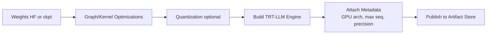

# 03 — TensorRT-LLM (Deep Dive)

## 1) Purpose
TensorRT-LLM provides high-performance LLM inference by:
- building optimized engines from weights
- using fused kernels and optimized attention
- improving KV cache efficiency and decode performance
- enabling lower precision modes (FP16/BF16/INT8)

## 2) Engine build workflow (step-by-step)

### Practical steps
1. Pin compatibility matrix (driver/CUDA/TRT/TRT-LLM)
2. Build engine with selected precision
3. Run functional tests (golden prompts)
4. Run perf tests (throughput curve + p99)
5. Publish immutable artifacts (versioned path)

## 3) Tuning levers (what to explain in interviews)
- Precision selection (FP16/BF16/INT8)
- Max sequence length and token limits
- KV cache sizing/strategy and memory headroom
- Tensor parallelism for large models
- CUDA graphs to reduce launch overhead

## 4) Failure modes and prevention
- OOM from long prompts -> admission controls, limits, headroom
- Tail latency spikes -> queue control, batching bounds, graphs
- Engine incompatibility -> strict build matrix + validation gates
