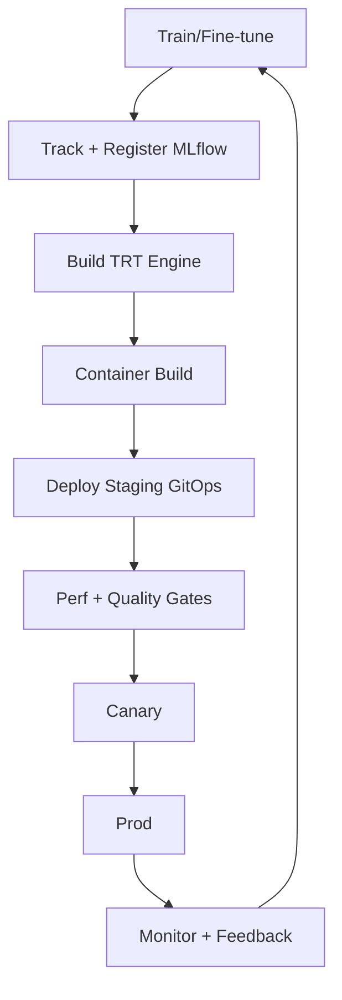

# 04 — LLMOps Pipeline (Kubeflow + MLflow + GitOps)

## 1) Why you need LLMOps
LLM artifacts are not just “one model file”:
- weights
- tokenizer and config
- TRT engine(s)
- evaluation sets and reports
- deployment manifests and runtime parameters

You need reproducibility, promotion, and rollback.

## 2) End-to-end workflow

## 3) Step-by-step implementation

### Step 1: Registry and lineage
- MLflow tracks: params, metrics, dataset pointers, prompt templates
- Each candidate gets a versioned ID

### Step 2: Engine build job
- CI job builds TRT engine
- Stores engine in immutable artifact path
- Writes metadata (precision, GPU arch, seq length)

### Step 3: Deployment config
- Git repo stores helm/kustomize manifests
- Model version pinned via config (ConfigMap/env) not hardcoded

### Step 4: Gates
**Performance gates**
- latency p95/p99 below threshold at target load
- error rate below threshold
- GPU memory headroom > X%

**Quality gates**
- regression suite on golden prompts
- optional safety checks

### Step 5: Promote + rollback
- Promote by changing model version pointer
- Roll back by reverting pointer (fast) and/or switching traffic split
