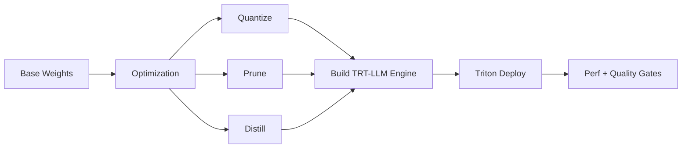
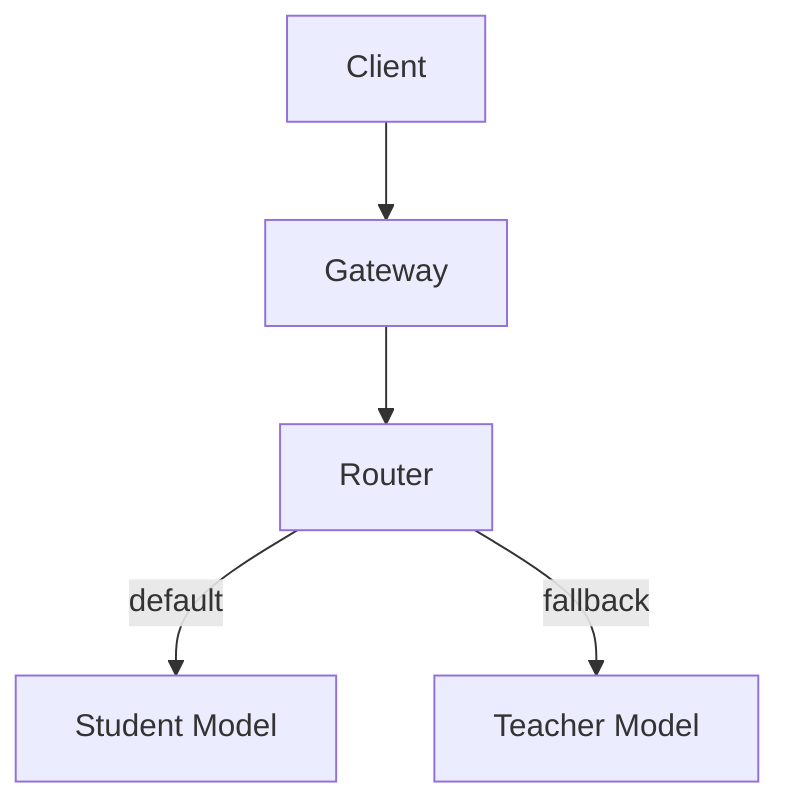

# 09 — Model Optimization in Practice (Quantization, Pruning, Distillation)

Generated: 2026-02-19T15:36:04.982992Z

This doc bridges the JD requirement: **pruning, quantization, knowledge distillation** and shows how they map to
**TensorRT-LLM + Triton** deployments.

---

## 1) Where optimization fits

Principle: optimize only when you can prove improved **cost/token** (or latency) while keeping quality within bounds.

---

## 2) Quantization (most common)

### What it is
Lower precision (FP16/BF16 → INT8/INT4) to reduce memory bandwidth and improve throughput.

### Step-by-step workflow
1. Define acceptance criteria (quality + regression prompts + safety)
2. Choose scheme (INT8 first; INT4 only if validated)
3. Calibrate (if required) using representative data
4. Build TRT-LLM engine(s) per GPU architecture
5. Run load tests: RPS vs p95/p99, tokens/sec, memory headroom
6. Canary deploy; rollback on drift or tail-latency regressions

### What to monitor
- p99 under peak context lengths
- OOM frequency
- output drift on golden prompts

---

## 3) Pruning (use carefully)

### What it is
Remove weights/neurons/heads to reduce compute/memory.

### Why it’s tricky for LLMs
Quality can drop in long-tail prompts. Gains can be smaller than quantization.

### Step-by-step workflow
1. Prefer structured pruning (GPU-friendly)
2. Prune → fine-tune to recover quality
3. Validate on wide prompt suite
4. Build TRT-LLM engine and benchmark
5. Only ship if cost/token improves and quality stays within thresholds

---

## 4) Knowledge distillation (practical for tiered serving)

### What it is
Train a smaller student model to approximate a larger teacher.

### Tiered routing pattern

Common routing criteria: tenant tier, prompt length/complexity, confidence heuristics.

---

## 5) Mapping to Triton + TRT-LLM
- Optimization happens pre-deploy (pipeline stage)
- TRT-LLM engine build publishes immutable artifacts
- Triton loads engines and serves standardized endpoints
- Gates + canary ensure safe promotion
