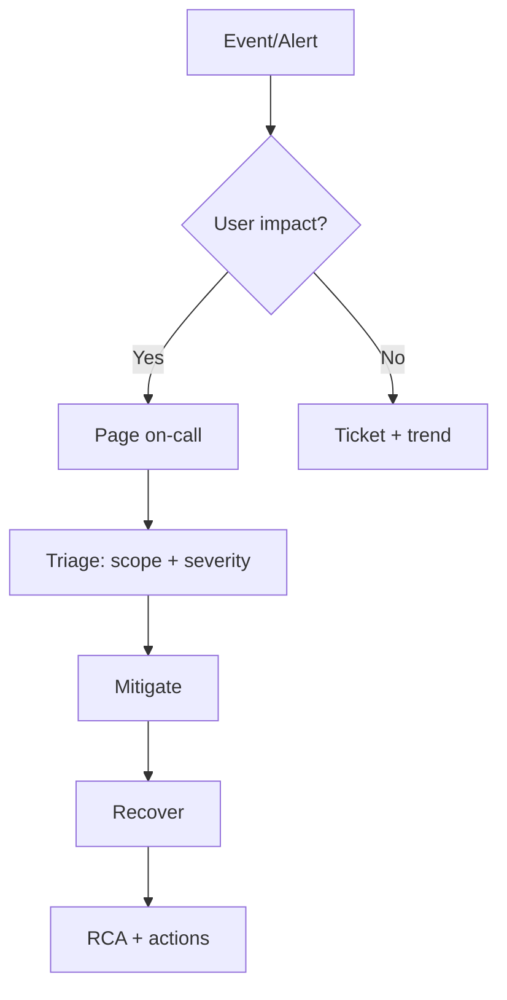

# 10 — Mission-Critical Operations (Incident, Change, Event)

Generated: 2026-02-19T15:36:04.982992Z

Addresses the JD requirement: **incident management, change management, event management** for a mission-critical inference platform.

---

## 1) Event management (signals → actionable events)

### Event sources
- Metrics alerts (latency, errors, saturation)
- Logs and traces
- GPU telemetry (utilization/memory/throttling)
- Platform events (node pressure, evictions)

### Triage flow

---

## 2) Incident management (step-by-step)

1. **Declare severity**
   - Use SLO burn rate + tenant impact.
2. **Stabilize**
   - Freeze changes; stop rollouts.
   - Roll back canary or shift traffic to known-good version.
   - Add capacity if saturation-driven.
3. **Diagnose fast**
   - Is queue time dominating compute time?
   - Any OOM/restarts?
   - GPU memory headroom and utilization?
   - Gateway timeouts or retry storms?
4. **Mitigate**
   - Reduce max context / max tokens temporarily.
   - Tighten rate limits per tenant.
   - Scale out (keep warm baseline).
5. **Communicate**
   - Single comms owner; regular updates.
6. **RCA**
   - Timeline, contributing factors, prevention actions.
   - Add pipeline gates/alerts/runbook updates.

---

## 3) Change management (safe releases)

### Controlled changes
- Model/engine versions
- Triton config (batching/concurrency/instances)
- GPU operator/drivers/CUDA stack
- Gateway/API policy

### Release checklist
- Staging pass + load test pass
- Rollback plan validated
- Canary plan + gates defined
- Monitoring dashboards open during release
- Post-release validation window

### Canary gates (typical)
- p99 <= baseline + X%
- error rate <= threshold
- no OOM increase
- GPU headroom >= threshold
