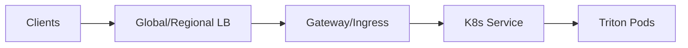

# 11 — Load Balancing, Traffic Management, and HA Routing

Generated: 2026-02-19T15:36:04.982992Z

Deep dive on **load balancing** and **availability** (JD: monitoring, load balancing, troubleshooting).

---

## 1) Where LB happens

- Global/Regional LB: multi-zone / multi-region
- Gateway/Ingress: TLS, auth, policy, canary splits
- Service: per-pod balancing in cluster

---

## 2) L4 vs L7 (why/when)
- L7: model routing, auth, canary/blue-green
- L4: high-throughput gRPC, lower overhead

Pattern: L7 at edge + optional L4 between gateway and Triton gRPC.

---

## 3) Draining and failover
- readiness gates on model-loaded state
- preStop drains connections
- topology spread across zones prevents single-zone collapse
