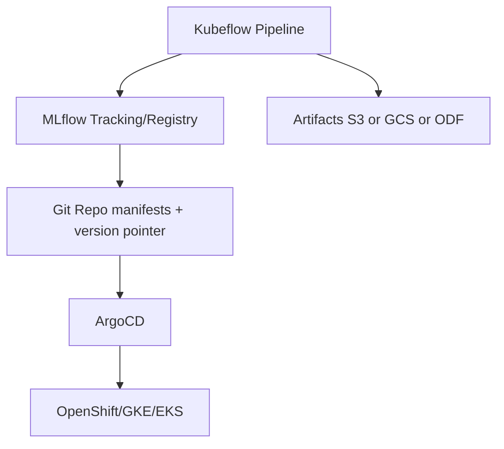

# 12 — Kubeflow / MLflow Practical Implementation

Generated: 2026-02-19T15:36:04.982992Z

Hands-on design notes for building an enterprise LLMOps pipeline with **Kubeflow Pipelines**, **MLflow registry**, and **GitOps**.

---

## 1) Reference pattern

---

## 2) Step-by-step building blocks

### A) Build stage (engine build)
- Inputs: weights + build params
- Outputs: TRT engines + metadata
- Store: immutable artifact paths (versioned)

### B) Evaluate stage
- Golden prompts + regression suite
- Perf tests: RPS curves, p95/p99, tokens/sec
- Log results to MLflow
- Produce gate decision

### C) Promote stage
- Update version pointer in Git (ConfigMap/values)
- ArgoCD sync applies changes to staging/canary/prod
- Rollback = revert pointer + traffic split
