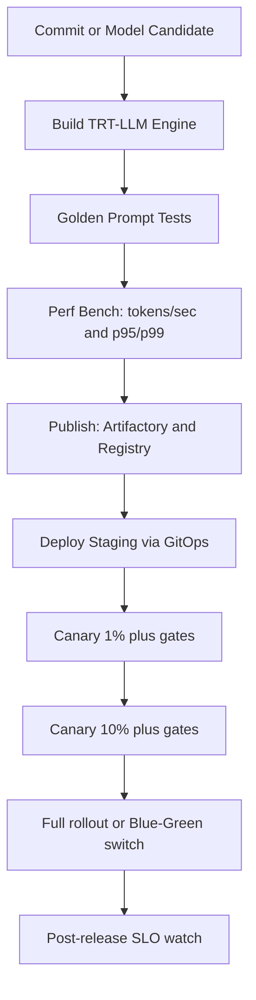

# 14 — End-to-end Build + Release Pipeline (TRT-LLM + Triton) with Canary + Parallel

Generated: 2026-02-19T16:08:24.382791Z

This is a **step-by-step** enterprise pipeline you can implement on:
- OpenShift (Tekton + ArgoCD) or Kubernetes (GitHub Actions/GitLab CI + ArgoCD)

It supports:
- **Canary** (weighted traffic, fast rollback)
- **Parallel/Blue-Green** (v1 and v2 live, switch over)
- **Shadow** (mirror traffic to v2/v3 for validation)

---

## 1) High-level pipeline stages

---

## 2) Step-by-step implementation

### Step 0 — Versioning and immutability
- Registry tag: `registry/llm/llama3-70b-trt:v3`
- Artifactory path: `/llm/llama3/70b/v3/models.tar.gz`
- Deploy by image **digest** for immutability (recommended)

### Step 1 — TRT-LLM engine build
Inputs:
- weights
- build params (precision, max seq, tensor parallel)

Outputs:
- engines
- metadata json (GPU arch, seq len, precision)

Gates:
- functional tests (golden prompts)
- regression suite
- perf smoke tests

### Step 2 — Package for distribution
Choose one:
- OCI model image (fast start)
- Artifactory tarball + initContainer (portable)

### Step 3 — Deploy staging (GitOps)
- bump a Git pointer (ConfigMap/values)
- ArgoCD applies changes

Validate:
- readiness
- synthetic inference probe

### Step 4 — Canary rollout
- deploy v3 alongside v2
- weights: 1% -> 10% -> 50% -> 100%
- gates: p99, errors, OOM, GPU headroom

Rollback:
- set weight back to v2
- revert Git pointer if needed

### Step 5 — Parallel/Blue-Green
- deploy v3, validate, flip to 100% during window
- keep v2 hot for rollback window

### Step 6 — Shadow
- mirror traffic to v3
- compare outputs and latency offline
- promote to canary

---

## 3) Traffic management choices
- Istio (best weighted canary)
- Gateway API (varies by implementation)
- External gateway (Kong/Apigee/NGINX)

---

## 4) Observability gates
- end-to-end latency and errors
- Triton queue vs compute
- GPU util and memory headroom
- restarts/OOM
- tokens/sec by version

---

## 5) Repo references
- Runbook: `runbooks/06-canary-parallel-shadow.md`
- Istio example: `manifests/40-istio-canary.yaml`
- Model image: `manifests/30-triton-with-model-image.yaml`
- Artifactory initContainer: `manifests/31-triton-with-artifactory-initcontainer.yaml`
